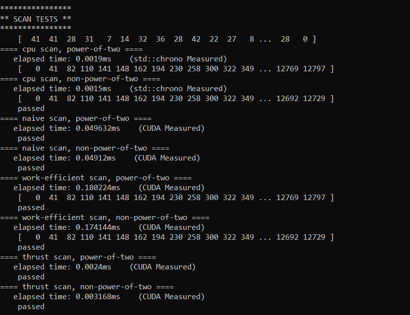
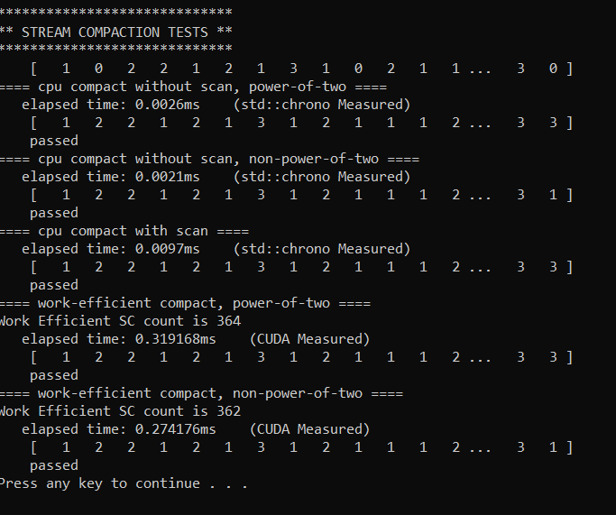
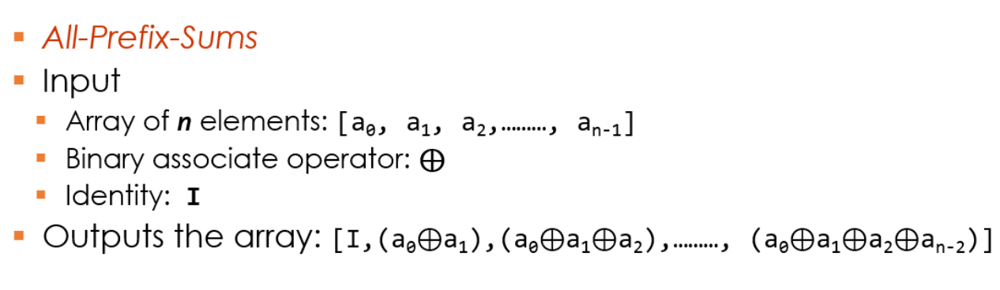
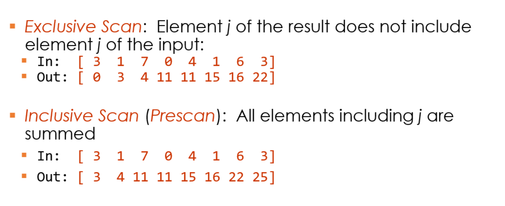
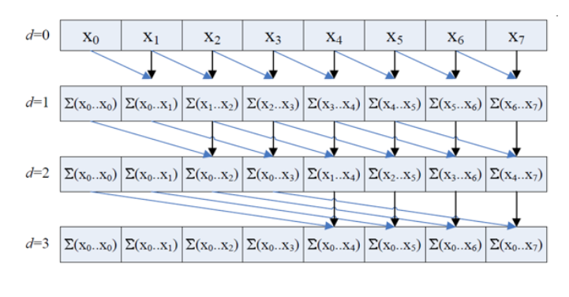
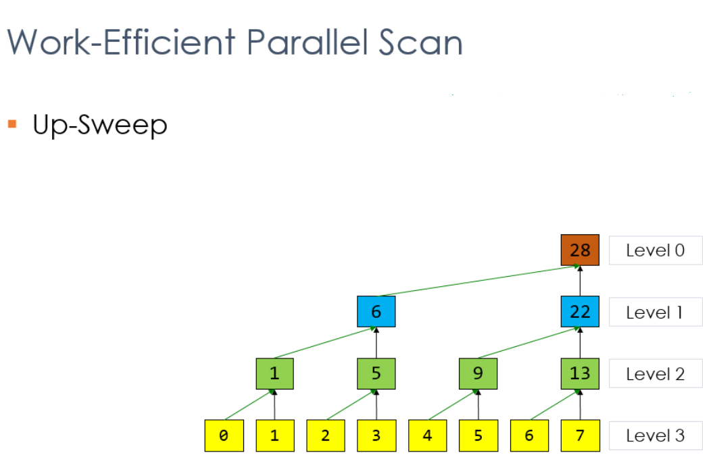
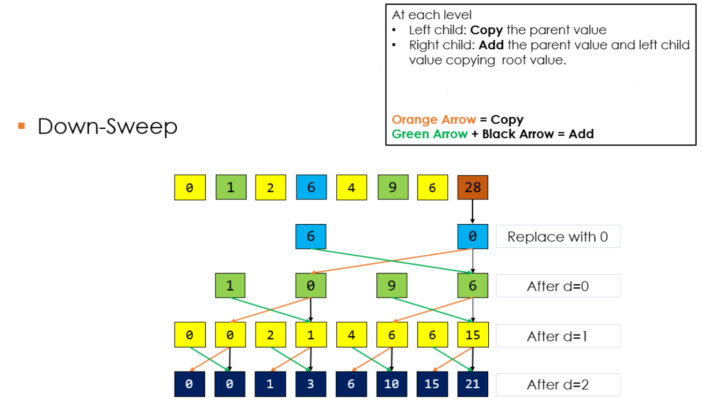
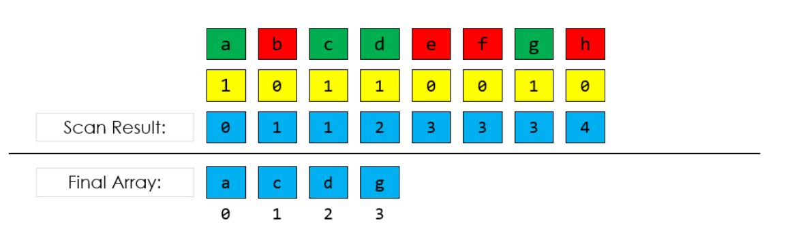

CUDA Stream Compaction
======================

**University of Pennsylvania, CIS 565: GPU Programming and Architecture, Project 2**

## SIREESHA PUTCHA 
	
*    [LinkedIn](https://www.linkedin.com/in/sireesha-putcha/)

*   [Facebook](https://www.facebook.com/sireesha.putcha98/)

*    [Portfolio](https://sites.google.com/view/sireeshaputcha/home)

*   sireesha@seas.upenn.edu

* Tested on personal computer - Microsoft Windows 10 Pro, 
Processor : Intel(R) Core(TM) i7-9750H CPU @ 2.60GHz, 2601 Mhz, 6 Core(s), 12 Logical Processor(s) 
GPU : NVIDIA GeForce RTX 2060

## OUTPUT 
* SCAN 

* STREAM COMPACTION 

# PROJECT OVERVIEW 

GPU stream compaction in CUDA from scratch. This algorithm is widely used. 

Stream compaction implementations in this project will simply remove `0`s
from an array of `int`s.

This project is meant to reorient our algorithmic thinking to the way of the GPU. On GPUs, many
algorithms can benefit from massive parallelism and, in particular, data
parallelism: executing the same code many times simultaneously with different
data.

Implementations include a few different versions of the *Scan* (*Prefix Sum*)
algorithm. First, is an implemention of a CPU version of the algorithm. Then, there are the GPU implementations: "naive" and
"work-efficient." Finally, these implementations are used in GPU stream compaction.

**Algorithm overview & details:** 
References 
* The [slides on Parallel Algorithms](https://docs.google.com/presentation/d/1ETVONA7QDM-WqsEj4qVOGD6Kura5I6E9yqH-7krnwZ0/edit#slide=id.p126)
  for Scan, Stream Compaction, and Work-Efficient Parallel Scan.
* GPU Gems 3, Chapter 39 - [Parallel Prefix Sum (Scan) with CUDA](https://developer.nvidia.com/gpugems/GPUGems3/gpugems3_ch39.html).
    - This online version contains a few small errors (in superscripting, missing braces, bad indentation, etc.)
    - We maintain a fix for this at [GPU Gem 3 Ch 39 Patch](https://github.com/CIS565-Fall-2017/Project2-Stream-Compaction/blob/master/INSTRUCTION.md#gpu-gem-3-ch-39-patch). 
* [Algorithm Examples](https://github.com/CIS565-Fall-2017/Project2-Stream-Compaction/blob/master/INSTRUCTION.md#algorithm-examples).
* [Recitation slides](https://docs.google.com/presentation/d/1daOnWHOjMp1sIqMdVsNnvEU1UYynKcEMARc_W6bGnqE/edit?usp=sharing)

The GPU stream compaction implementation lives inside of the
`stream_compaction` subproject. .

## SCAN : 
This is also called All Prefix Sum. 

There are 2 types of scans : 

* Exclusive scan : Elem j of the result does not include elem j of input. 

* Inclusive Scan : All elements including j are summed up and output in the j element. 

### Ways to implement scan 

* Naive Parallel Scan :In this, each thread writes one sum and reads two values 

* Work Efficient Parallel Scan : This scan uses a balanced binary tree concept. There are 2 phases in this scan. 

** Upsweep : This phase is similar to parallel reduction. The sum of all elements is stored in the last element. 

** Downsweep : Traverse back down the tree using partial sums. 

## STREAM COMPACTION: 
Given an array, create a new array of elements that meet a certain criteria. There are 3 steps in this process: 

* 1) Compute a temporary array with 0s and 1s based on the given condition. 

* 2) Run and exclusive scan on this temporary array. 

* 3) Scatter the elements. Use the result of scan as an index to write to the final output array if the value for that element is 1 in the temporary array. 

## Algorithm Examples

* scan:
  - goal: produce a prefix sum array of a given array (we only care about exclusive scan here)
  - input
    - [1 5 0 1 2 0 3]
  - output
    - [0 1 6 6 7 9 9]
* compact:
  - goal: closely and neatly packed the elements != 0
  - input
    - [1 5 0 1 2 0 3]
  - output
    - [1 5 1 2 3]
* compactWithoutScan (CPU)
  - an implementation of compact. So the goal, input and output should all be the same as compact
  - Simply loop through the input array, meanwhile maintain a pointer indicating which address shall we put the next non-zero element
* compactWithScan (CPU/GPU)
  - an implementation of compact. So the goal, input and output should all be the same as compact
  - 3 steps
    - map
      + goal: map our original data array (integer, Light Ray, etc) to a bool array
      + input
        - [1 5 0 1 2 0 3]
      + output
        - [1 1 0 1 1 0 1]
    - scan
        + take the output of last step as input
        + input
          - [1 1 0 1 1 0 1]
        + output
          - [0 1 2 2 3 4 4]
    - scatter
        + preserve non-zero elements and compact them into a new array
        + input:
          + original array
            - [1 5 0 1 2 0 3]
          + mapped array
            - [1 1 0 1 1 0 1]
          + scanned array
            - [0 1 2 2 3 4 4]
        + output:
          - [1 5 1 2 3]
        + This can be done in parallel on GPU
        + You can try multi-threading on CPU if you want (not required and not our focus)
        + for each element input[i] in original array
          - if it's non-zero (given by mapped array)
          - then put it at output[index], where index = scanned[i]
