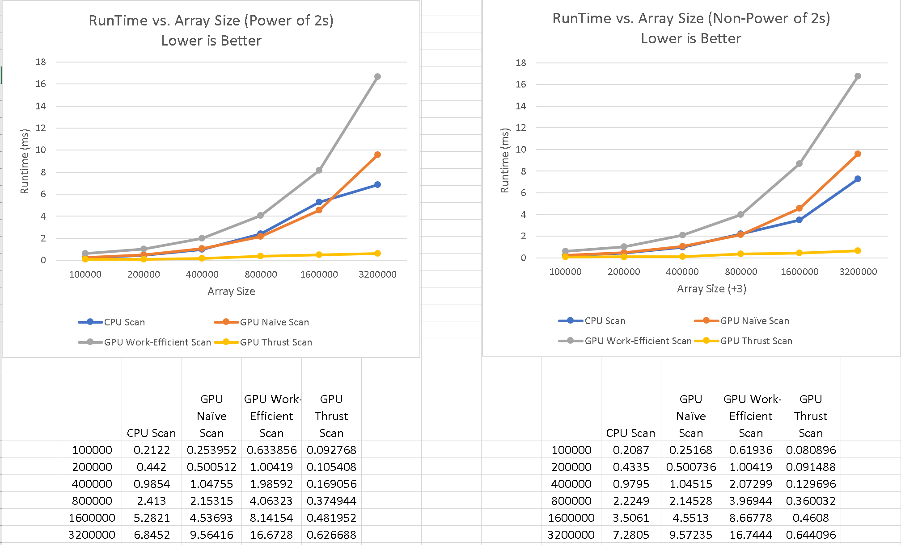

CUDA Stream Compaction
======================

**University of Pennsylvania, CIS 565: GPU Programming and Architecture, Project 2**

* Hanyu Liu
  * [personal website](http://liuhanyu.net/) 
* Tested on: Windows 10, Intel(R) Core(TM) i7-7700HQ CPU @ 2.80GHz 16.0GB, GeForce GTX 1050 (Personal)

### Summary of Project

In this project, I implemented stream compaction, which simply removes `0`s from an array of `1`s, on both the CPU and the GPU in CUDA. Stream compaction uses the scan (Prefix Sum) Algorithm, and in this project, I implemented four different scan methods: 1) Scan on the CPU, 2) Naive, 3) Work-Efficient, and 4) Using Thrust. Furthermore, GPU stream compaction also needed additional kernels to generate a boolean mask and scatter, which I also implemented. With the help of these functions, I was able to implement stream compaction on both the GPU and the CPU. 


Stream compaction is widely used, and will be used to accelerate my future path tracer project. 


### Performance Analysis



1. For the Thrust implementation, the runtime is significantly lower than the other implementations. This is possibly due to the small amount of memory copy as it alters the data in place without the need for extra buffers. 

2. Here, we see that the Naive and Work-Efficient scans both take much longer than the CPU scan at large array sizes even though we are altering the array in parallel on the GPU. In fact, the work-efficient scan takes much longer than the naive scan. Both GPU implementations take longer possibly because there is more overhead from the kernel calls. As for the difference between Naive and Work-Efficient scans, the work-efficient scan takes two for loops on larger, padded arrays, which causes it to be slower than the naive implementation. Ultimately, the bottle-neck is the number of additions we have to perform, which is log base2 of n. The rest of the performance depends on memory allocation, the cache, and overhead, in which case, CPU would win out. 

3. ```
   
   ****************
   ** SCAN TESTS **
   ****************
       [   3   5  18  11   7  47  39  47  30  45   5   9  40 ...  23   0 ]
   ==== cpu scan, power-of-two ====
      elapsed time: 0.0023ms    (std::chrono Measured)
       [   0   3   8  26  37  44  91 130 177 207 252 257 266 ... 24162 24185 ]
   ==== cpu scan, non-power-of-two ====
      elapsed time: 0.0051ms    (std::chrono Measured)
       [   0   3   8  26  37  44  91 130 177 207 252 257 266 ... 24142 24149 ]
       passed
   ==== naive scan, power-of-two ====
      elapsed time: 0.023552ms    (CUDA Measured)
       passed
   ==== naive scan, non-power-of-two ====
      elapsed time: 0.022528ms    (CUDA Measured)
       passed
   ==== work-efficient scan, power-of-two ====
      elapsed time: 0.1024ms    (CUDA Measured)
       passed
   ==== work-efficient scan, non-power-of-two ====
      elapsed time: 0.132096ms    (CUDA Measured)
       passed
   ==== thrust scan, power-of-two ====
      elapsed time: 0.079872ms    (CUDA Measured)
       passed
   ==== thrust scan, non-power-of-two ====
      elapsed time: 0.090336ms    (CUDA Measured)
       passed
   
   *****************************
   ** STREAM COMPACTION TESTS **
   *****************************
       [   3   3   2   1   3   3   3   3   0   1   3   3   2 ...   1   0 ]
   ==== cpu compact without scan, power-of-two ====
      elapsed time: 0.0073ms    (std::chrono Measured)
       [   3   3   2   1   3   3   3   3   1   3   3   2   2 ...   2   1 ]
       passed
   ==== cpu compact without scan, non-power-of-two ====
      elapsed time: 0.0074ms    (std::chrono Measured)
       [   3   3   2   1   3   3   3   3   1   3   3   2   2 ...   3   1 ]
       passed
   ==== cpu compact with scan ====
      elapsed time: 0.0363ms    (std::chrono Measured)
       [   3   3   2   1   3   3   3   3   1   3   3   2   2 ...   2   1 ]
       passed
   ==== work-efficient compact, power-of-two ====
      elapsed time: 0.192512ms    (CUDA Measured)
       passed
   ==== work-efficient compact, non-power-of-two ====
      elapsed time: 0.171008ms    (CUDA Measured)
       passed
   Press any key to continue . . .
   ```


