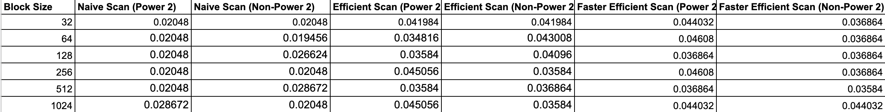
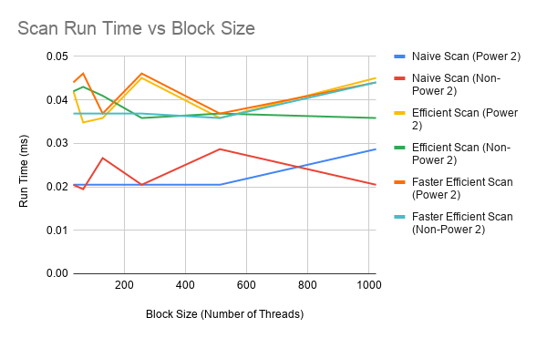
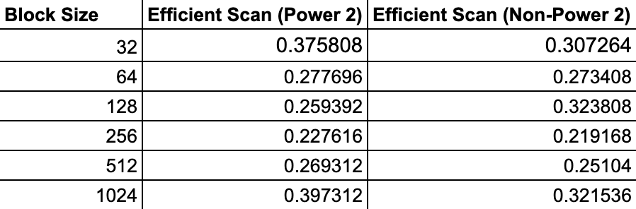
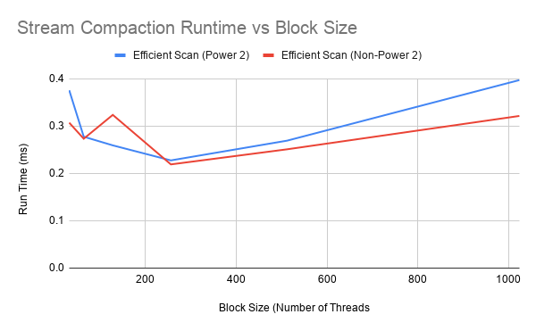
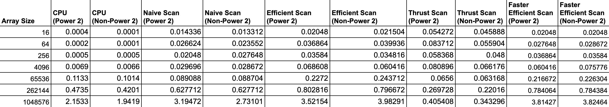
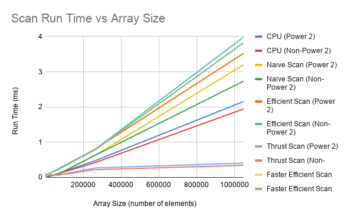

CUDA Stream Compaction
======================

**University of Pennsylvania, CIS 565: GPU Programming and Architecture, Project 2**

* Sydney Miller
  * [LinkedIn](https://www.linkedin.com/in/sydney-miller-upenn/)
* Tested on: GTX 222 222MB (CETS Virtual Lab)


### README

### Performance Analysis

#### Optimize Block Sizes for Each Implementation






For most of the implementations it seems like they perform the best when the black size is not too big or small. A smaller block size for stream compaction seemed to work better compared to scan.

#### Compare GPU Scan implementations to Serial CPU For Varying Array Sizess



All of the implementations performed similarly in that the run time increased when the size of the array increased. The thrust implementation compared to the other implementation was much faster and a much shallower slope as seen in the chart above. This means that the thrust implementation handles exponential growth of array sizes a lot better than the other implementations. My guess is that the thrust implementation handles memory allocation much better than the other GPU implementations since we are able to see the greatest performance difference with larger amounts of memory being used. The CPU implantation was the next fastest implementation. I think the bottlenecks for the various GPU implementations are their use of global memory. In addition, some implementation use %, which can take longer on a GPU compared to comparison operators.

#### Output of Test Program
```
****************
** SCAN TESTS **
****************
    [   5  39   0   1  23  32  46  30  49  44  40  18  31 ...  10   0 ]
==== cpu scan, power-of-two ====
   elapsed time: 0.0005ms    (std::chrono Measured)
    [   0   5  44  44  45  68 100 146 176 225 269 309 327 ... 6474 6484 ]
==== cpu scan, non-power-of-two ====
   elapsed time: 0.0005ms    (std::chrono Measured)
    [   0   5  44  44  45  68 100 146 176 225 269 309 327 ... 6380 6411 ]
    passed
==== naive scan, power-of-two ====
   elapsed time: 0ms    (CUDA Measured)
    passed
==== naive scan, non-power-of-two ====
   elapsed time: 0ms    (CUDA Measured)
    passed
==== work-efficient scan, power-of-two ====
   elapsed time: 0.043008ms    (CUDA Measured)
    passed
==== work-efficient scan, non-power-of-two ====
   elapsed time: 0.03584ms    (CUDA Measured)
    passed
==== thrust scan, power-of-two ====
   elapsed time: 0.0856ms    (CUDA Measured)
    passed
==== thrust scan, non-power-of-two ====
   elapsed time: 0.04608ms    (CUDA Measured)
    passed

*****************************
** STREAM COMPACTION TESTS **
*****************************
    [   1   3   0   3   1   2   0   2   3   0   0   2   3 ...   2   0 ]
==== cpu compact without scan, power-of-two ====
   elapsed time: 0.0009ms    (std::chrono Measured)
    [   1   3   3   1   2   2   3   2   3   3   2   2   2 ...   3   2 ]
    passed
==== cpu compact without scan, non-power-of-two ====
   elapsed time: 0.0011ms    (std::chrono Measured)
    [   1   3   3   1   2   2   3   2   3   3   2   2   2 ...   3   1 ]
    passed
==== cpu compact with scan ====
   elapsed time: 0.0006ms    (std::chrono Measured)
    [   1   3   3   1   2   2   3   2   3   3   2   2   2 ...   3   2 ]
    passed
==== work-efficient compact, power-of-two ====
   elapsed time: 0.033792ms    (CUDA Measured)
    passed
==== work-efficient compact, non-power-of-two ====
   elapsed time: 0.044032ms    (CUDA Measured)
    passed
```
