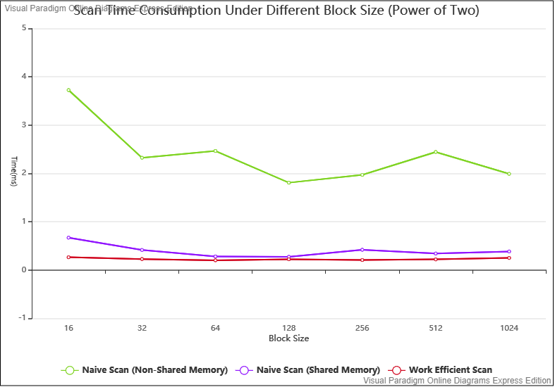
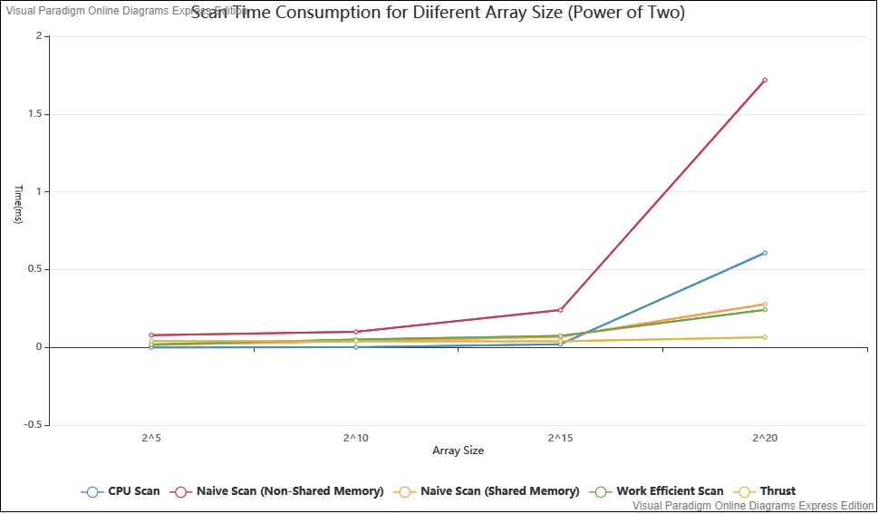
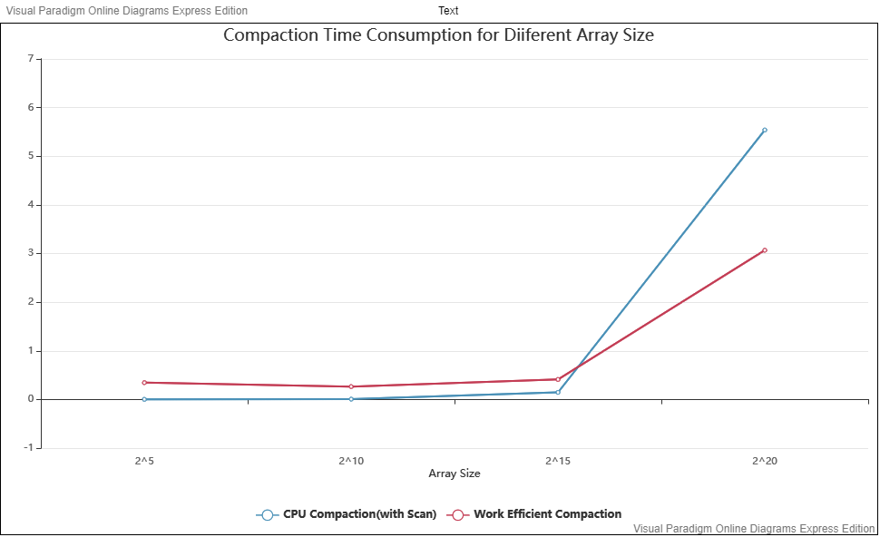
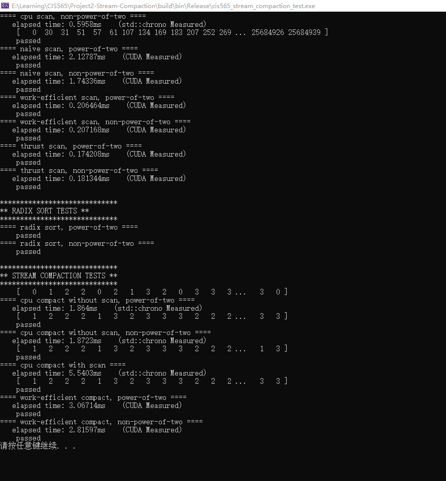

CUDA Stream Compaction
======================

**University of Pennsylvania, CIS 565: GPU Programming and Architecture, Project 2**

* Xuecheng Sun
  * (TODO) [LinkedIn](), [personal website](), [twitter](), etc.
* Tested on: Windows 10, R7-3700x @ 3.7GHz, 32GB, RTX 2070 super 8GB 

### Feature Implemented

1. CPU Scan/Compaction
2. Naive Scan
3. Work-Efficient Scan/Compaction
4. Thrust Scan
5. (Extra Credit Part 5) Thread Optimization for Work-Efficient Scan
6. (Extra Credit Part 6) Radix Sort
7. (Extra Credit Part 7.1) Shared Memory Optimization for Naive Scan

### Implementation Details

**Thread Optimization for Work-Efficient Scan**: It is very inefficient to process all entries of the given array. Because for each loop, we only process data when its index is equals to 2^d. So I set the thread number to "n / 2^(d + 1)" to limit the thread numbers. This highly improved performance about 80%. Because the original code of work-efficient sort is replaced by improved one, it is hard to compare these two versions. Therefore, all following work-efficient method is improved thread number method.

**Radix Sort**: I wrote radix sort under the file efficient.cu and compared it with std::sort results to validate the result.

**Shared Memory Optimization**: I only Implement shared memory optimization for naive scan. I set a 2 * blocksize shared memory for each blocks' data access. These shared memories are two ping-pong buffers, which will exchange during each scan. For each block, it will scan within the range of block itself. This array I called it **partial scan array**. And then I will take the biggest value for each block and scan this new biggest value array again.  If this array is longer than block size, program will independently process its data in the range of block size again. This will separation processing will stop when the array size is smaller than block size. This is implemented by two for loops and two stacks. For the first loop, we move deeper and deeper until we have the biggest array which length is smaller than block size. During each loop, we will push all **partial scan array** into array stack (I actually push the first pointer of this array into stack), and also push its length into length stack. For the second loop, we add them together to get the final scan result. This process could cause memory leak, so be sure you release all memories in the second loop. After implement this, the performance of naive scan have a huge improvement. The efficiency is up to the work-efficient method without shared memory.

### Results

#### Scan Time Consumption under Different Block Size

**Block Size:** Naive scan(NSM) will consume less time time when the block size is bigger and bigger, in comparison naive scan(SM) and work efficient methods are more static when block size is changing.  For all naive scan method when block size is 128, they can have the best performance. For the shared memory method, the block size 128 will let each block hold 1KB shared memory, this setting doesn't reach the condition for block reducing in each SM. For normal naive scan, when the block size is bigger than 16 the time consuming are fluctuating around 2ms. This could because normally a warp will take 32 threads to compute, if we have a 16 threads block this cannot fully use the GPU SM processors. 

#### Scan Time Consumption for Different Array Size

#### Compaction Time Consumption for Different Array Size

**Array Size**: It is really interesting that when the array size is lower than 2 ^ 20, the cpu method is faster than any gpu methods. For naive scan(NSM), it always  has biggest time consumption. This could because the naive scan (NSM) will always have a huge IO delay to access global memory and will access more times to global memory than CPU scan. After some optimization, naive scan(SM) can be improved to the performance of work efficient scan(NSM). For all gpu methods, although we will process data parallelly, the program will have more times to access data. So the balance between accessing delay and parallel processing will affect the final result of time consumption. When the array size growing, the affection of parallel processing will play a more important role in final performance.

#### All Outputs of Program

