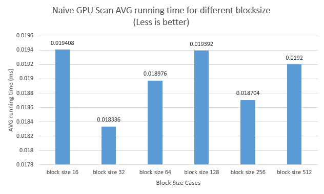
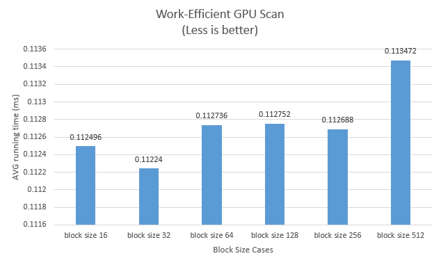
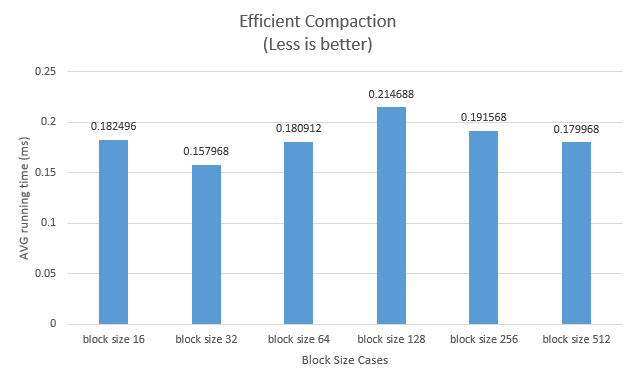
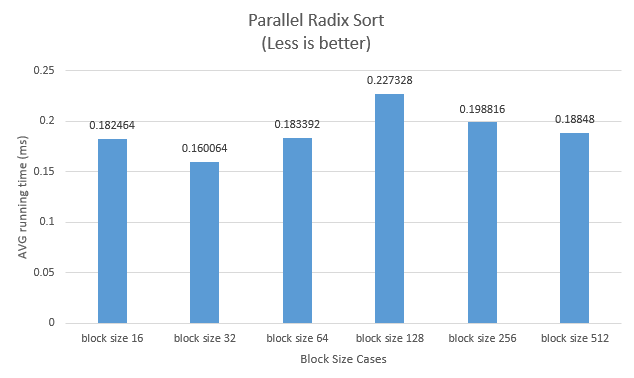
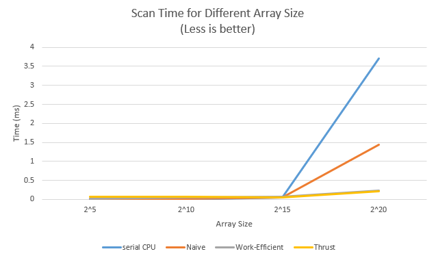

CUDA Stream Compaction
======================

**University of Pennsylvania, CIS 565: GPU Programming and Architecture**

* Jiarui Yan
  * [LinkedIn](https://www.linkedin.com/in/jiarui-yan-a06bb5197?lipi=urn%3Ali%3Apage%3Ad_flagship3_profile_view_base_contact_details%3BvRlITiOMSt%2B9Mgg6SZFKDQ%3D%3D), [personal website](https://jiaruiyan.pb.online/), [twitter](https://twitter.com/JerryYan1997), etc.
* Tested on: Windows 10 Home, i7-9700K @ 3.60GHz 16GB DDR4 RAM, RTX 2070 SUPER 8GB Dedicated GPU memory (Personal desktop)

## Features

* CPU Scan & Stream Compaction

* Naive GPU Scan Algorithm

* Work-Efficient GPU Scan & Stream Compaction

* Thrust scan

* Compact threads (Part 5 Extra Credit -- +5)

* Parallel Radix Sort (Part 6 Extra Credit -- +10)

## Roughly optimize for each implementations

In this part, in order to determine the suitable blocksize for each implementations, I run different scenarios under several discrete blocksizes: 16, 32, 64, 128, 256, 512. Then, I collect their average running time and plot them respectively. They are shown below:









As you can see from graphs above, a blocksize that is 32 is suitable for all the scenarios. I think this maybe caused by the fact that the input array size is not long enough. I control the input size for power-of-two scenarios to be 256. Besides, 32 is also the number of threads in a warp. As a result, 32 is a preferable size for all of them. Subsequently, I will fix their blocksize to 32 and do analysis under this blocksize. 

## Performance comparsion



As we can see from the graph above, we can figure out that GPU's advantages can be shown when the length of input array is long enough. 

As for Thrust implementation, I guess it implement shared memory and all sorts of tricks to improve the proformence and try their best to exclude operations like memory copy.

## Brief explanation of phenomena

From my observation of the NSight timeline, all of my code are bounded by memory I/O, because the gap between each computation is relatively bigger than computation parts. Besides, each implementation is different. For instance, Naive scan would hand in lots of CUDA kernels, while other implementation hands in less kernels. 

### Output of the test program

Here is the output by inputing an 2^20 array. As for the 'parallel radix sort', please take a look at the thrid part of the ouput below.

```
****************
** SCAN TESTS **
****************
    [   3  16  44  30   6   8  15  16  11  48  38  32  12 ...  46   0 ]
==== cpu scan, power-of-two ====
   elapsed time: 3.6953ms    (std::chrono Measured)
    [   0   3  19  63  93  99 107 122 138 149 197 235 267 ... 25674322 25674368 ]
==== cpu scan, non-power-of-two ====
   elapsed time: 1.3371ms    (std::chrono Measured)
    [   0   3  19  63  93  99 107 122 138 149 197 235 267 ... 25674263 25674285 ]
    passed
==== naive scan, power-of-two ====
   elapsed time: 0.999616ms    (CUDA Measured)
    passed
==== naive scan, non-power-of-two ====
   elapsed time: 0.999424ms    (CUDA Measured)
    passed
==== work-efficient scan, power-of-two ====
   elapsed time: 0.227328ms    (CUDA Measured)
    passed
==== work-efficient scan, non-power-of-two ====
   elapsed time: 0.223232ms    (CUDA Measured)
    passed
==== thrust scan, power-of-two ====
   elapsed time: 0.245824ms    (CUDA Measured)
    passed
==== thrust scan, non-power-of-two ====
   elapsed time: 0.309088ms    (CUDA Measured)
    passed

*****************************
** STREAM COMPACTION TESTS **
*****************************
    [   1   2   0   0   2   0   3   0   3   0   0   2   0 ...   2   0 ]
==== cpu compact without scan, power-of-two ====
   elapsed time: 2.0501ms    (std::chrono Measured)
    passed
==== cpu compact without scan, non-power-of-two ====
   elapsed time: 2.0319ms    (std::chrono Measured)
    passed
==== cpu compact with scan ====
   elapsed time: 7.6485ms    (std::chrono Measured)
    passed
==== work-efficient compact, power-of-two ====
   elapsed time: 0.7328ms    (CUDA Measured)
    passed
==== work-efficient compact, non-power-of-two ====
   elapsed time: 0.733216ms    (CUDA Measured)
    passed

*****************************
** PARALLEL RADIX SORT TESTS **
*****************************
    [   3  16  44  30   6   8  15  16  11  48  38  32  12 ...  46   0 ]
==== parallel radix sort, power-of-two correct result ====
    [   0   0   0   0   0   0   0   0   0   0   0   0   0 ...  49  49 ]
==== parallel radix sort, power-of-two correct result ====
    [   0   0   0   0   0   0   0   0   0   0   0   0   0 ...  49  49 ]
==== parallel radix sort, power-of-two ====
    [   0   0   0   0   0   0   0   0   0   0   0   0   0 ...  49  49 ]
   elapsed time: 0.733216ms    (CUDA Measured)
    passed
==== parallel radix sort, non-power-of-two ====
    [   0   0   0   0   0   0   0   0   0   0   0   0   0 ...  49  49 ]
   elapsed time: 0.733216ms    (CUDA Measured)
    passed
```
