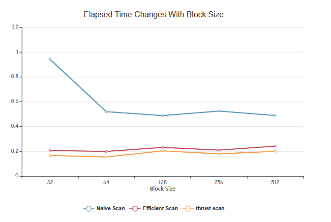
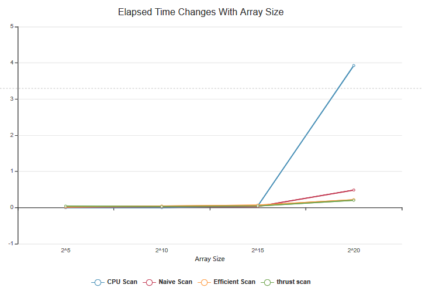

CUDA Stream Compaction
======================

**University of Pennsylvania, CIS 565: GPU Programming and Architecture, Project 2**

* Haoyu Sui
  	* [LinkedIn](http://linkedin.com/in/haoyu-sui-721284192)
* Tested on: Windows 10, i5-9600K @ 3.70GHz 16GB, RTX 2070 SUPER 8GB 
* SM：7.5

### Features
* CPU Scan & Stream Compaction
* Naive GPU Scan Algorithm
* Work-Efficient GPU Scan & Stream Compaction
* Using Thrust's Implementation

### Analysis

**Roughly optimize for each implementations**

In order to find the appropriate block size to make each method produce the best performance, I tried several different block sizes for each method: 32, 64, 128, 256, 512. The results can be seen in the table below. (Array size is 2^20)



**Performance analysis**

I chose a block size of 128, and then performed a different array size performance test for each method. It can be seen from the figure that when the array size is relatively large, the performance advantage of GPU is more obvious. Among the three different GPU methods, Thrust Scan and Efficient Scan have better performance than Naive Scan.




### Output in cmd
```
****************
** SCAN TESTS **
****************
    [   8   9  43  42  23   4   8  38  23  10  27  11  44 ...  45   0 ]
==== cpu scan, power-of-two ====
   elapsed time: 3.9358ms    (std::chrono Measured)
    [   0   8  17  60 102 125 129 137 175 198 208 235 246 ... 25659338 25659383 ]
==== cpu scan, non-power-of-two ====
   elapsed time: 1.4142ms    (std::chrono Measured)
    [   0   8  17  60 102 125 129 137 175 198 208 235 246 ... 25659264 25659282 ]
    passed
==== naive scan, power-of-two ====
   elapsed time: 0.485664ms    (CUDA Measured)
    passed
==== naive scan, non-power-of-two ====
   elapsed time: 0.485152ms    (CUDA Measured)
    passed
==== work-efficient scan, power-of-two ====
   elapsed time: 0.219872ms    (CUDA Measured)
    passed
==== work-efficient scan, non-power-of-two ====
   elapsed time: 0.19888ms    (CUDA Measured)
    passed
==== thrust scan, power-of-two ====
   elapsed time: 0.204576ms    (CUDA Measured)
    passed
==== thrust scan, non-power-of-two ====
   elapsed time: 0.214432ms    (CUDA Measured)
    passed

*****************************
** STREAM COMPACTION TESTS **
*****************************
    [   1   1   1   2   1   1   0   1   2   0   1   3   1 ...   0   0 ]
==== cpu compact without scan, power-of-two ====
   elapsed time: 2.5239ms    (std::chrono Measured)
    [   1   1   1   2   1   1   1   2   1   3   1   2   3 ...   1   1 ]
    passed
==== cpu compact without scan, non-power-of-two ====
   elapsed time: 2.2133ms    (std::chrono Measured)
    [   1   1   1   2   1   1   1   2   1   3   1   2   3 ...   1   1 ]
    passed
==== cpu compact with scan ====
   elapsed time: 8.8561ms    (std::chrono Measured)
    [   1   1   1   2   1   1   1   2   1   3   1   2   3 ...   1   1 ]
    passed
==== work-efficient compact, power-of-two ====
   elapsed time: 1.19734ms    (CUDA Measured)
    passed
==== work-efficient compact, non-power-of-two ====
   elapsed time: 0.7928ms    (CUDA Measured)
    passed
```