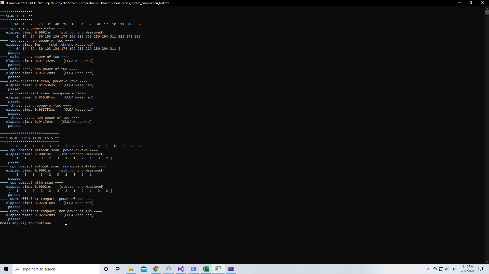
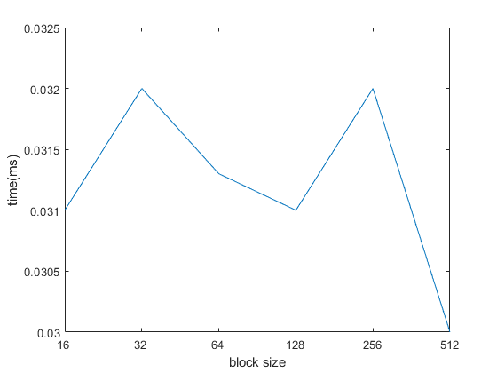
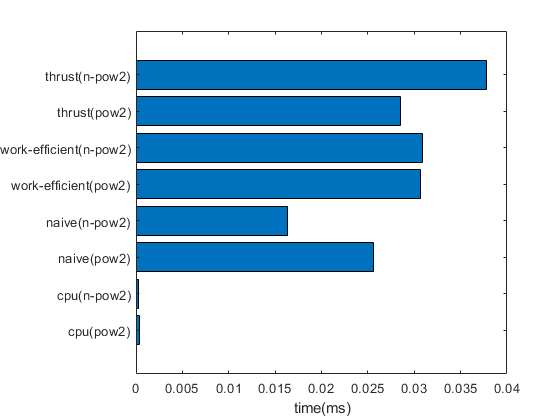

CUDA Stream Compaction
======================

**University of Pennsylvania, CIS 565: GPU Programming and Architecture, Project 2**

* Dayu Li
* Tested on: Windows 10, i7-10700K @ 3.80GHz 16GB, GTX 2070 8150MB (Personal laptop)

## Features

##### CPU: 

-CPU Scan, CPU Comact  

##### GPU: 

-Naive Scan, Work-Efficient Scan, Thrust Scan  

-Work-Efficient Compact

###### Extra:

-Why is CPU faster than Work-efficient?

-Radix Sort algorithm


## Performance Analysis
### Blocksize Optimization
The graph below shows how the work efficient compact runtime changes with the block size. To me there is no obvious change of the runtime during the change of block size, similar to the previous project.  



### Runtime Comparison
The graphs below compare the runtime of different scan implementations for the small array size.  


 - When the array size is small, CPU scan has the best performance. This is due to the extra efforts spent on calling the kernel and CUDA, as we expected, multi-threaded process runs slower than the normal computations when the task is small.   
 
 - When the array size is large, CPU scan runs slower and gpu is playing better. Where the thrust may be the best. This is due to the utilization of shared memory instead of global memory.  
### Extra Credit: 
#### Why is My GPU Approach So Slow?
One of the reasons why work efficient scan is slower than expected is the fact that there are too much useless threads during the computation process that are created but never used. The existance of the useless threads will play a more important role when the array size is getting larger.  

To resolve this, I changeed the number of threads (iterations times) within the work efficient compact function, from 2^d to 2^(d-i), this will reduce the number of threads that are created without changing any of the results.  

Before:
 - number of threads = 2^d
After:
 - number of threads = 2^(d-i)

After optimization, work efficient is significantly improved.  
 - testted on 128 blocksize
 
 ||Before| After
|--|--|--|
|2^8|0.2152 ms|0.03081 ms|
|2^16|4.31 ms|1.062 ms|

#### Radix sort (Not finished)

just follow the slides from the course.  
Uncomment this part in the main.cpp will show the test result.  
```
//printDesc("radix sort test");
//genArray(RADIXSIZE, radix, 32);
//zeroArray(RADIXSIZE, radix_sorted);
//StreamCompaction::Efficient::radixSort(RADIXSIZE, 6, radix, radix_sorted);
//printArray(RADIXSIZE, radix, true);
//printArray(RADIXSIZE, radix_sorted, true);
```
