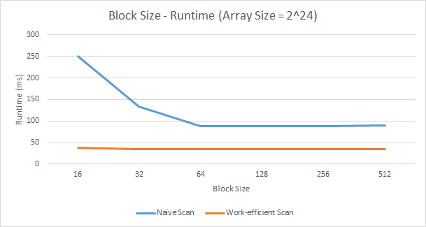
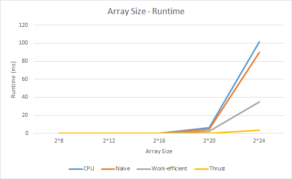
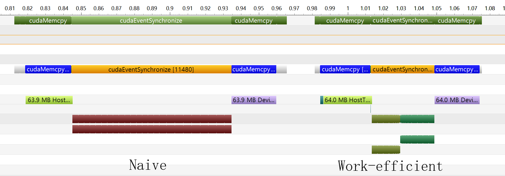

CUDA Stream Compaction
======================

**University of Pennsylvania, CIS 565: GPU Programming and Architecture, Project 2**

* Szeyu Chan
  * [LinkedIn](https://www.linkedin.com/in/szeyuchan11/)
* Tested on: Windows 10, i7-10510U @ 1.80GHz 16GB, MX250 2048MB (Personal Laptop)

### Features
* CPU Scan & Stream Compaction
* Naive GPU Scan Algorithm
* Work-Efficient GPU Scan & Stream Compaction

### Analysis

#### Block Size (Threads per Block)
  
According to the experiment, I chose 128 as the block size for both Naive implementation and work-efficient implementation.

#### Array Size
  
The Thrust implementation is so efficient. According to the Nsight Timeline, I guess shared memory may be used for optimization.  

#### Performance Bottleneck
  
For a Naive scan implementation, the performance bottleneck is computation (the dark red part). While for a work-efficient scan implementation, memory copy costs much more than computation. (Array Size = 2^24)

### Output
```
****************
** SCAN TESTS **
****************
    [  25   8   8  44  34  15  13  24  12  37  33  49  10 ...  17   0 ]
==== cpu scan, power-of-two ====
   elapsed time: 65.7953ms    (std::chrono Measured)
    [   0  25  33  41  85 119 134 147 171 183 220 253 302 ... 411028981 411028998 ]
==== cpu scan, non-power-of-two ====
   elapsed time: 23.7746ms    (std::chrono Measured)
    [   0  25  33  41  85 119 134 147 171 183 220 253 302 ... 411028920 411028958 ]
    passed
==== naive scan, power-of-two ====
   elapsed time: 88.662ms    (CUDA Measured)
    passed
==== naive scan, non-power-of-two ====
   elapsed time: 88.7263ms    (CUDA Measured)
    passed
==== work-efficient scan, power-of-two ====
   elapsed time: 35.2655ms    (CUDA Measured)
    [   0  25  33  41  85 119 134 147 171 183 220 253 302 ... 411028981 411028998 ]
    passed
==== work-efficient scan, non-power-of-two ====
   elapsed time: 35.2287ms    (CUDA Measured)
    passed
==== thrust scan, power-of-two ====
   elapsed time: 3.67821ms    (CUDA Measured)
    [   0  25  33  41  85 119 134 147 171 183 220 253 302 ... 411028981 411028998 ]
    passed
==== thrust scan, non-power-of-two ====
   elapsed time: 3.54509ms    (CUDA Measured)
    passed

*****************************
** STREAM COMPACTION TESTS **
*****************************
    [   1   3   1   3   2   2   0   2   3   3   1   3   3 ...   1   0 ]
==== cpu compact without scan, power-of-two ====
   elapsed time: 35.6661ms    (std::chrono Measured)
    [   1   3   1   3   2   2   2   3   3   1   3   3   2 ...   2   1 ]
    passed
==== cpu compact without scan, non-power-of-two ====
   elapsed time: 35.8474ms    (std::chrono Measured)
    [   1   3   1   3   2   2   2   3   3   1   3   3   2 ...   1   2 ]
    passed
==== cpu compact with scan ====
   elapsed time: 134.251ms    (std::chrono Measured)
    [   1   3   1   3   2   2   2   3   3   1   3   3   2 ...   2   1 ]
    passed
==== work-efficient compact, power-of-two ====
   elapsed time: 47.6788ms    (CUDA Measured)
    passed
==== work-efficient compact, non-power-of-two ====
   elapsed time: 47.8573ms    (CUDA Measured)
    passed
```
