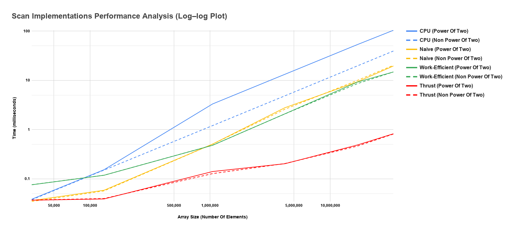

CUDA Stream Compaction
======================

**University of Pennsylvania, CIS 565: GPU Programming and Architecture, Project 2**

* Jacky Lu
  * [LinkedIn](https://www.linkedin.com/in/jacky-lu-506968129/)


# README

## Result:
### The implementations' block sizes seem to be optimized at 128 threads per block.

### Performance Comparison Between GPU Scan Implementations (Naive, Work-Efficient, and Thrust) And CPU Scan Implementations
#### (Tested With 128 Threads Per Block)


### Output Of The Test Program With 33,554,432 Array Elements (Tested With 128 Threads Per Block)
```
****************
** SCAN TESTS **
****************
    [  12   3  19  17  37  34   6  17  18  22  23   8  49 ...  17   0 ]
==== cpu scan, power-of-two ====
   elapsed time: 102.834ms    (std::chrono Measured)
    [   0  12  15  34  51  88 122 128 145 163 185 208 216 ... 821676053 821676070 ]
==== cpu scan, non-power-of-two ====
   elapsed time: 38.8949ms    (std::chrono Measured)
    [   0  12  15  34  51  88 122 128 145 163 185 208 216 ... 821675987 821676034 ]
    passed
==== naive scan, power-of-two ====
   elapsed time: 19.5621ms    (CUDA Measured)
    [   0  12  15  34  51  88 122 128 145 163 185 208 216 ... 821676053 821676070 ]
    passed
==== naive scan, non-power-of-two ====
   elapsed time: 19.9352ms    (CUDA Measured)
    [   0  12  15  34  51  88 122 128 145 163 185 208 216 ... 821675987 821676034 ]
    passed
==== work-efficient scan, power-of-two ====
   elapsed time: 14.7942ms    (CUDA Measured)
    [   0  12  15  34  51  88 122 128 145 163 185 208 216 ... 821676053 821676070 ]
    passed
==== work-efficient scan, non-power-of-two ====
   elapsed time: 14.8075ms    (CUDA Measured)
    [   0  12  15  34  51  88 122 128 145 163 185 208 216 ... 821675987 821676034 ]
    passed
==== thrust scan, power-of-two ====
   elapsed time: 0.8088ms    (CUDA Measured)
    [   0  12  15  34  51  88 122 128 145 163 185 208 216 ... 821676053 821676070 ]
    passed
==== thrust scan, non-power-of-two ====
   elapsed time: 0.806624ms    (CUDA Measured)
    [   0  12  15  34  51  88 122 128 145 163 185 208 216 ... 821675987 821676034 ]
    passed

*****************************
** STREAM COMPACTION TESTS **
*****************************
    [   0   2   1   2   0   0   3   3   1   2   2   2   2 ...   2   0 ]
==== cpu compact without scan, power-of-two ====
   elapsed time: 60.1642ms    (std::chrono Measured)
    [   2   1   2   3   3   1   2   2   2   2   3   1   3 ...   3   2 ]
    passed
==== cpu compact without scan, non-power-of-two ====
   elapsed time: 60.4809ms    (std::chrono Measured)
    [   2   1   2   3   3   1   2   2   2   2   3   1   3 ...   1   3 ]
    passed
==== cpu compact with scan ====
   elapsed time: 205.018ms    (std::chrono Measured)
    [   2   1   2   3   3   1   2   2   2   2   3   1   3 ...   3   2 ]
    passed
==== work-efficient compact, power-of-two ====
   elapsed time: 17.7603ms    (CUDA Measured)
    [   2   1   2   3   3   1   2   2   2   2   3   1   3 ...   3   2 ]
    passed
==== work-efficient compact, non-power-of-two ====
   elapsed time: 17.4516ms    (CUDA Measured)
    [   2   1   2   3   3   1   2   2   2   2   3   1   3 ...   1   3 ]
    passed
```

