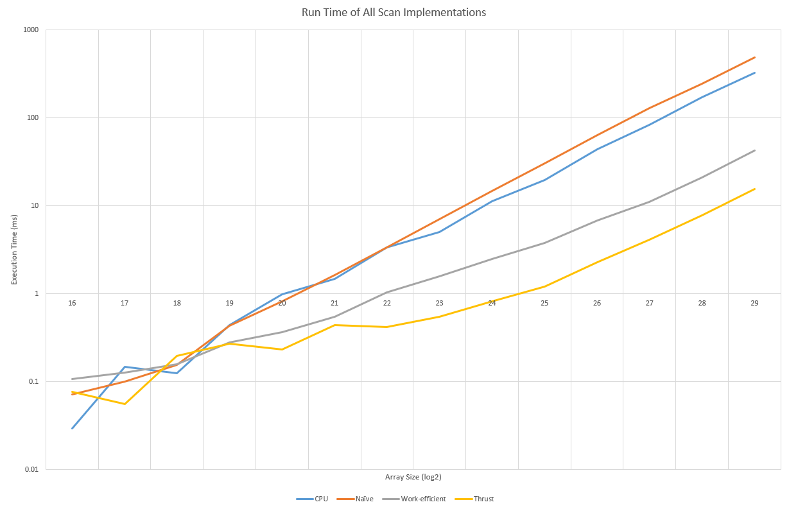

CUDA Stream Compaction
======================

**University of Pennsylvania, CIS 565: GPU Programming and Architecture, Project 2**

* Xuanyi Zhou
  * [LinkedIn](https://www.linkedin.com/in/xuanyi-zhou-661365192/), [Github](https://github.com/lukedan)
* Tested on: Windows 10, i7-9750H @ 2.60GHz 32GB, RTX 2060 6GB

## Features

- Regular CPU and thrust implementations of scan and compact operations.
- Naive implementation of the scan operation.
- Recursive efficient scan implementation that supports arbitrary array lengths, and makes use of shared memory & bank conflict optimizations.
- Efficient compact implementaiton making use of the efficient scan operation.

## Questions

- Roughly optimize the block sizes of each of your implementations for minimal run time on your GPU.

  For Naive scan, changing the block size does not affect executing time much as the operation is bounded by memory bandwidth. For efficient scan and compaction, the optimal block size is around 64/128. From tracing the program it can be seen that thrust also uses a block size of 128.

- Compare all of these GPU Scan implementations (Naive, Work-Efficient, and Thrust) to the serial CPU version of Scan. Plot a graph of the comparison (with array size on the independent axis).

  Below is the graph of run time of all implementations:

  

  See `data.xlsx` for the raw data. Note that since the efficient scan implementation is recursive, some memory allocations are included in the final time.

  For small array sizes, all methods are fairly fast and the run times are relatively unpredictable. As the array size increases, the relationship between the run times become consistent: the naive scan is the slowest, followed by the CPU implementation, the work-efficient scan, and finally the thrust implementation is the fastest.

  Looking at the Nsight timeline and kernel calls it can be seen that the number of threads spawned by the thrust implementation is far less than the work-efficient implementation which requires one thread for every two array elements. The thrust implementation also uses far more registers per thread. This suggests that the thrust implementation may be using an optimization mentioned in the GPU gems chapter, which is performing a scan operation for a few elements in each thread in serial, then aggregating the results by performing a scan on the sums.

  Interestingly, the time gaps between copying data from CPU to GPU and back are roughly the same for the work-efficient implementation and the thrust implementation as shown in the timeline, but the work-efficient implementation is busy throughout the period while the thrust implementation is largely idle for the first half of the gap. Currently I do not have a reasonable explanation for this.

- Write a brief explanation of the phenomena you see here.

  Since the naive implementation does not use any shared memory, it's understandable that it would be slower than the CPU implementation as the GPU has a much lower clock speed than the CPU, and does not have nearly the same amount of cache.

  The thrust implementation and the work-efficient implementation are faster than the CPU version. The thrust version is about three times faster as it may have utilized other optimizations such as the one mentioned in the previous answer.

  The reason why the optimization mentioned before works may be that it reduces the number of processed elements by a large factor (4x if 4 elements are summed in serial) while summing a few numbers in serial is relatively cheap and is very well parallelized.

- Paste the output of the test program into a triple-backtick block in your README.

  The tests for radix sort can be seen at the end of the output.

  ```
  ****************
  ** SCAN TESTS **
  ****************
      [  45   4  11  40  10   5  35  48  33  44   0  28  24 ...  41   0 ]
  ==== cpu scan, power-of-two ====
    elapsed time: 78.9076ms    (std::chrono Measured)
      [   0  45  49  60 100 110 115 150 198 231 275 275 303 ... -1007647599 -1007647558 ]
  ==== cpu scan, non-power-of-two ====
    elapsed time: 77.9638ms    (std::chrono Measured)
      [   0  45  49  60 100 110 115 150 198 231 275 275 303 ... -1007647704 -1007647672 ]
      passed
  ==== naive scan, power-of-two ====
    elapsed time: 133.709ms    (CUDA Measured)
      passed
  ==== naive scan, non-power-of-two ====
    elapsed time: 112.619ms    (CUDA Measured)
      passed
  ==== work-efficient scan, power-of-two ====
    elapsed time: 11.0549ms    (CUDA Measured)
      passed
  ==== work-efficient scan, non-power-of-two ====
    elapsed time: 11.0906ms    (CUDA Measured)
      passed
  ==== thrust scan, power-of-two ====
    elapsed time: 4.04538ms    (CUDA Measured)
      passed
  ==== thrust scan, non-power-of-two ====
    elapsed time: 4.0943ms    (CUDA Measured)
      passed

  *****************************
  ** STREAM COMPACTION TESTS **
  *****************************
      [   3   0   2   2   1   0   0   2   2   3   2   3   1 ...   2   0 ]
  ==== cpu compact without scan, power-of-two ====
    elapsed time: 307.968ms    (std::chrono Measured)
      [   3   2   2   1   2   2   3   2   3   1   3   2   2 ...   2   2 ]
      passed
  ==== cpu compact without scan, non-power-of-two ====
    elapsed time: 304.929ms    (std::chrono Measured)
      [   3   2   2   1   2   2   3   2   3   1   3   2   2 ...   2   2 ]
      passed
  ==== cpu compact with scan ====
    elapsed time: 422.665ms    (std::chrono Measured)
      [   3   2   2   1   2   2   3   2   3   1   3   2   2 ...   2   2 ]
      passed
  ==== work-efficient compact, power-of-two ====
    elapsed time: 25.4493ms    (CUDA Measured)
      [   3   2   2   1   2   2   3   2   3   1   3   2   2 ...   2   2 ]
      passed
  ==== work-efficient compact, non-power-of-two ====
    elapsed time: 23.5873ms    (CUDA Measured)
      [   3   2   2   1   2   2   3   2   3   1   3   2   2 ...   2   2 ]
      passed
  ==== thrust compact, power-of-two ====
    elapsed time: 4.44602ms    (CUDA Measured)
      passed
  ==== thrust compact, non-power-of-two ====
    elapsed time: 4.03315ms    (CUDA Measured)
      passed

  *********************
  ** RADIX SORT TEST **
  *********************
      [ 943102324 1728649027 1523795418 230368144 1853983028 219035492 1373487995 539655339 345004302 1682352720 528619710 1142157171 735013686 ... 646714987 484939495 ]
  ==== radix sort, power-of-two ====
    elapsed time: 1305.98ms    (CUDA Measured)
      passed
      [  42  45  55  58  63  67  78 122 162 170 188 206 221 ... 1999999985 1999999998 ]
  ==== radix sort, non-power-of-two ====
    elapsed time: 1338.5ms    (CUDA Measured)
      passed
      [  42  45  55  58  63  67  78 122 162 170 188 206 221 ... 1999999985 1999999998 ]
  Press any key to continue . . .
  ```
