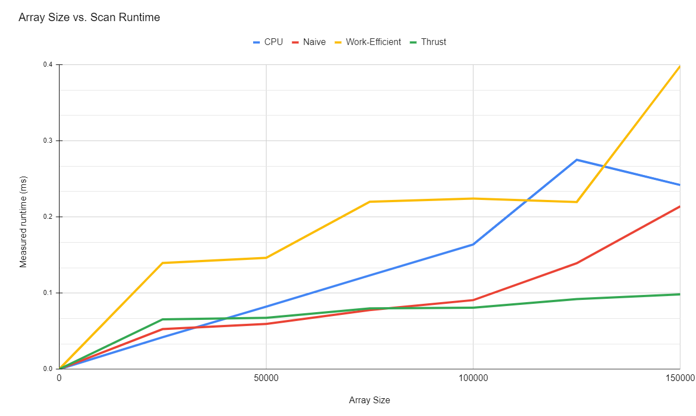
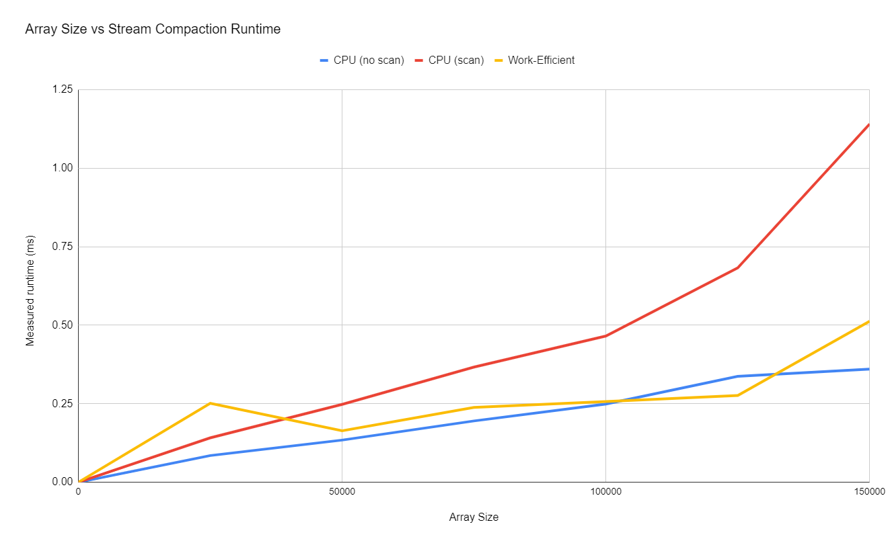

CUDA Stream Compaction
======================

**University of Pennsylvania, CIS 565: GPU Programming and Architecture, Project 2**

* Name: Gizem Dal
  * [LinkedIn](https://www.linkedin.com/in/gizemdal), [personal website](https://www.gizemdal.com/)
* Tested on: Predator G3-571 Intel(R) Core(TM) i7-7700HQ CPU @ 2.80 GHz 2.81 GHz - Personal computer (borrowed my friend's computer for the semester)

**Project Description**

The main focus of this project is implementing GPU stream compaction and other parallel algorithms in CUDA which are widely used and important for accelerating path tracers and algorithmic thinking. I implemented a few different versions of the Scan (Prefix Sum) algorithm including CPU scan, naive GPU scan, work-efficient GPU scan and GPU Thrust library scan. Then, I used some of these scan implementations to implement stream compaction for CPU and GPU. All of these implementations are timed in order to show runtime comparisons between different approaches and do a comprehensive performance analysis.

**Project Tasks**

* **CPU Algorithms**
  * CPU Scan
  * CPU Stream Compaction (without Scan)
  * CPU Stream Compaction (with Scan)
* **GPU Algorithms**
  * Naive Scan
  * Work-Efficient Scan
  * Work-Efficient Stream Compaction
  * Thrust Scan

**Performance Analysis**

Both CPU and GPU timing functions are warapped up as a performance timer class in order to measure the time cost conveniently. We use *std::chrono* to provide CPU high-precision timing and CUDA event to measure the CUDA performance. In order to measure the performance of the implementation itself, I **have not** included the cost of initial and final memory operations on the GPU such as cudaMalloc() or cudaMemcpy() while timing the runtime.

As the first step of the performance analysis, let's compare the performance of different scan implementations. In order to achieve this, I passed different block sizes to be used on the GPU while keeping the input size constant. I defined one input array with randomly generated integers except I read two different amounts of items: 2^20 (thus an exact power of 2) and 2^20 - 3 (thus 3 integers less). I will refer to the first size as **POT (Power Of Two)** and the second size as **NPOT (Non-Power Of Two)**.


*Timed performances of CPU, GPU naive, GPU work-efficient & GPU thrust scan functions with different block sizes*

As expected, changing the block size doesn't have a notable impact on the CPU scan. However, there is a significant performance gap between CPU scan calls with POT and NPOT. Since I'm running the CPU scan with POT before the CPU scan with NPOT, it's possible that the array could be stored in cache after the first test, which would result in making the second test unintentionally run faster.

Using a block size of 32 makes the naive and work efficient GPU scan functions significantly inefficient with large inputs. Block sizes greater than or equal to 64 have fluctuating time costs for the naive GPU scan for both POT and NPOT. With the current array size, using a block size of 512 gives the most optimal outcome for this particular scan implementation. Although we don't have the same time cost for POT and NPOT inputs at block sizes 64, 128, 256 and 1024, the difference is somewhat negligible. If we observe the results from the work-efficient implementation, we can say that using 128 blocks is the most optimal with the current input size. Once we hit the optimal result at blockSize=128, increasing the block size to be greater than 128 results in inefficiency. With the optimal block size, this implementation runs faster than CPU and naive GPU scan with both POT or NPOT inputs.

The GPU thrust scan performs the fastest by a significant difference with very little fluctuation between different block sizes. It's possible that thrust scan could be using some methods to reduce memory latency. Increasing the block size doesn't seem to have a notable impact on thrust scan performance, in fact it can sometimes result in a very slightly less efficient result with POT inputs.

As the next step of the analysis, I measured the performance of all the scan and stream compaction implementations with different input sizes while maintaining the block size at 128.

**Array Size versus Scan Measured Performance**



**Array Size versus Stream Compaction Measured Performance**



I also measured the performances with very large input sizes (greater than 1 million). Since it is difficult to represent this data with a graph, I have included a table below for both scan and stream compaction performances.

**Array Size versus Scan Measured Performance**

Method | CPU | Naive | Work Efficient | Thrust
:---: | :---: | :---: | :---: | :---:
Array size = 2^20 | 5.2834 ms | 1.813 ms | 1.628 ms | 0.26 ms
Array size = 2^15 | 152.3 ms | 75.14 ms | 50 ms | 2.18 ms

**Array Size versus Stream Compaction Measured Performance**

Method | CPU (with scan) | Work Efficient
:---: | :---: | :---:
Array size = 2^20 | 8.75 ms | 1.85 ms
Array size = 2^15 | 256.065 ms | 53.5 ms

CPU implementations works the fastest with small inputs, however their runtimes scales up very quickly once the input size gets closer to 1 million. We don't observe the work-efficient and Thrust scan implementations to be faster than naive implementation until we hit much larger input sizes where we benefit more from parallelism. Although the work-efficient approach runs significantly faster than the naive approach once the 1 million mark is hit, it still gets inefficient very quickly while the thrust implementation remains significantly fast in comparison. This could be due to a bottleneck in work-efficient implementation memory I/O which could be resolved by using shared instead of global memory.

To provide an insight on how the performance is measured, I included a sample performance test outputs below. These tests use a block size of 128 and input size of 2^18.

```
****************
** SCAN TESTS **
****************
    [   3  28  39   7  17  30  13   2  29   5  29   6  44 ...   1   0 ]
==== cpu scan, power-of-two (First run) ====
   elapsed time: 1.1686ms    (std::chrono Measured)
    [   0   3  31  70  77  94 124 137 139 168 173 202 208 ... 6421970 6421971 ]
==== cpu scan, power-of-two (Second run) ====
   elapsed time: 1.1714ms    (std::chrono Measured)
    [   0   3  31  70  77  94 124 137 139 168 173 202 208 ... 6421970 6421971 ]
==== cpu scan, non-power-of-two (First run) ====
   elapsed time: 0.4859ms    (std::chrono Measured)
    [   0   3  31  70  77  94 124 137 139 168 173 202 208 ... 6421921 6421944 ]
    passed
==== cpu scan, non-power-of-two (Second run) ====
   elapsed time: 0.4544ms    (std::chrono Measured)
    [   0   3  31  70  77  94 124 137 139 168 173 202 208 ... 6421921 6421944 ]
    passed
==== naive scan, power-of-two ====
   elapsed time: 0.415968ms    (CUDA Measured)
    passed
==== naive scan, non-power-of-two ====
   elapsed time: 0.421344ms    (CUDA Measured)
    passed
==== work-efficient scan, power-of-two ====
   elapsed time: 0.527264ms    (CUDA Measured)
    passed
==== work-efficient scan, non-power-of-two ====
   elapsed time: 0.503168ms    (CUDA Measured)
    passed
==== thrust scan, power-of-two ====
   elapsed time: 0.306752ms    (CUDA Measured)
    passed
==== thrust scan, non-power-of-two ====
   elapsed time: 0.299136ms    (CUDA Measured)
    passed

*****************************
** STREAM COMPACTION TESTS **
*****************************
    [   1   2   1   3   1   2   1   0   1   1   1   0   2 ...   3   0 ]
==== cpu compact without scan, power-of-two ====
   elapsed time: 0.8395ms    (std::chrono Measured)
    [   1   2   1   3   1   2   1   1   1   1   2   3   2 ...   1   3 ]
    passed
==== cpu compact without scan, non-power-of-two ====
   elapsed time: 0.7936ms    (std::chrono Measured)
    [   1   2   1   3   1   2   1   1   1   1   2   3   2 ...   1   3 ]
    passed
==== cpu compact with scan ====
   elapsed time: 2.1656ms    (std::chrono Measured)
    [   1   2   1   3   1   2   1   1   1   1   2   3   2 ...   1   3 ]
    passed
==== work-efficient compact, power-of-two ====
   elapsed time: 0.43952ms    (CUDA Measured)
    passed
==== work-efficient compact, non-power-of-two ====
   elapsed time: 0.443168ms    (CUDA Measured)
    passed
```
