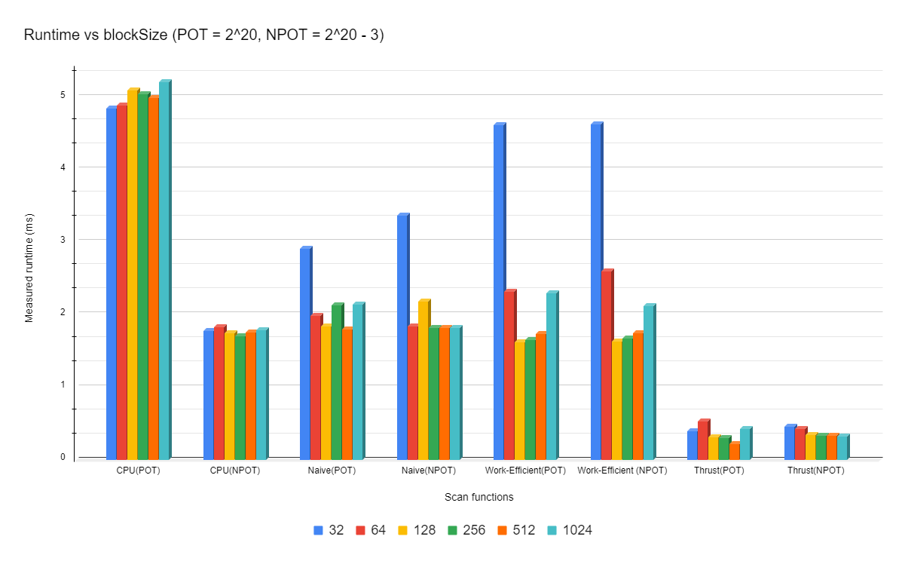

CUDA Stream Compaction
======================

**University of Pennsylvania, CIS 565: GPU Programming and Architecture, Project 2**

* Name: Gizem Dal
  * [LinkedIn](https://www.linkedin.com/in/gizemdal), [personal website](https://www.gizemdal.com/)
* Tested on: Predator G3-571 Intel(R) Core(TM) i7-7700HQ CPU @ 2.80 GHz 2.81 GHz - Personal computer (borrowed my friend's computer for the semester)

**Project Description**

The main focus of this project is implementing GPU stream compaction and other parallel algorithms in CUDA which are widely used and important for accelerating path tracers and algorithmic thinking. I implemented a few different versions of the Scan (Prefix Sum) algorithm including CPU scan, naive GPU scan, work-efficient GPU scan and GPU Thrust library scan. Then, I used some of these scan implementations to implement stream compaction for CPU and GPU. All of these implementations are timed in order to show runtime comparisons between different approaches and do a comprehensive performance analysis in the following section.

**Performance Analysis**

Both CPU and GPU timing functions are warapped up as a performance timer class in order to measure the time cost conveniently. We use *std::chrono* to provide CPU high-precision timing and CUDA event to measure the CUDA performance. In order to measure the performance of the implementation itself, I **have not** included the cost of initial and final memory operations on the GPU such as cudaMalloc() or cudaMemcpy() while timing the runtime.

As the first step of the performance analysis, let's compare the performance of different scan implementations. In order to achieve this, I passed different block sizes to be used on the GPU while keeping the input size constant. I defined two input arrays with randomly generated integers where one array has a size of 2^20 (thus an exact power of 2) while the other array's size is 2^20 - 3. I will refer to the first array as **POT (Power Of Two)** and the second array as **NPOT (Non-Power Of Two)** for the rest of the analysis.


*Timed performances of CPU, GPU naive, GPU work-efficient & GPU thrust scan functions with different block sizes*

As expected, changing the block size doesn't have a notable impact on the CPU scan. If we observe the time costs from naive and work-efficient GPU implementations we can see that using a block size of 32 makes the GPU scan functions significantly inefficient with large inputs.

Block sizes greater than or equal to 64 have fluctuating time costs for the naive GPU scan for both POT and NPOT inputs. With the current array size, using a block size of 512 gives the most optimal outcome for this particular scan implementation. Although we don't have the same time cost for POT and NPOT inputs at block sizes 64, 128, 256 and 1024, the difference is somewhat negligible.

If we observe the results from the work-efficient implementation, we can say that using 128 blocks is the most optimal with the current input size. Once we hit the optimal result at blockSize=128, increasing the block size to be greater than 128 results in inefficiency. With the optimal block size, this implementation runs faster than CPU and naive GPU scan with both POT or NPOT inputs.

The GPU thrust scan performs the fastest with very little fluctuation between different block sizes. Increasing the block size doesn't seem to have a significant impact on thrust scan performance, in fact it can potentially result in a very slightly less efficient result with POT inputs.

```****************
** SCAN TESTS **
****************
    [  46  27   0  28  19  24  10  37   8  21   7  41  15 ...  30   0 ]
==== cpu scan, power-of-two ====
   elapsed time: 0.001ms    (std::chrono Measured)
    [   0  46  73  73 101 120 144 154 191 199 220 227 268 ... 5999 6029 ]
==== cpu scan, non-power-of-two ====
   elapsed time: 0.0005ms    (std::chrono Measured)
    [   0  46  73  73 101 120 144 154 191 199 220 227 268 ... 5953 5975 ]
    passed
==== naive scan, power-of-two ====
   elapsed time: 0.019456ms    (CUDA Measured)
    passed
==== naive scan, non-power-of-two ====
   elapsed time: 0.019456ms    (CUDA Measured)
    passed
==== work-efficient scan, power-of-two ====
   elapsed time: 0.104448ms    (CUDA Measured)
    passed
==== work-efficient scan, non-power-of-two ====
   elapsed time: 0.120832ms    (CUDA Measured)
    passed

*****************************
** STREAM COMPACTION TESTS **
*****************************
    [   0   3   0   0   1   0   0   3   2   1   1   3   3 ...   2   0 ]
==== cpu compact without scan, power-of-two ====
   elapsed time: 0.0009ms    (std::chrono Measured)
    [   3   1   3   2   1   1   3   3   2   3   3   2   1 ...   3   2 ]
    passed
==== cpu compact without scan, non-power-of-two ====
   elapsed time: 0.0008ms    (std::chrono Measured)
    [   3   1   3   2   1   1   3   3   2   3   3   2   1 ...   2   1 ]
    passed
==== cpu compact with scan ====
   elapsed time: 0.0033ms    (std::chrono Measured)
    [   3   1   3   2   1   1   3   3   2   3   3   2   1 ...   3   2 ]
    passed
==== work-efficient compact, power-of-two ====
   elapsed time: 0.041984ms    (CUDA Measured)
    passed
==== work-efficient compact, non-power-of-two ====
   elapsed time: 0.171008ms    (CUDA Measured)
    passed
```
