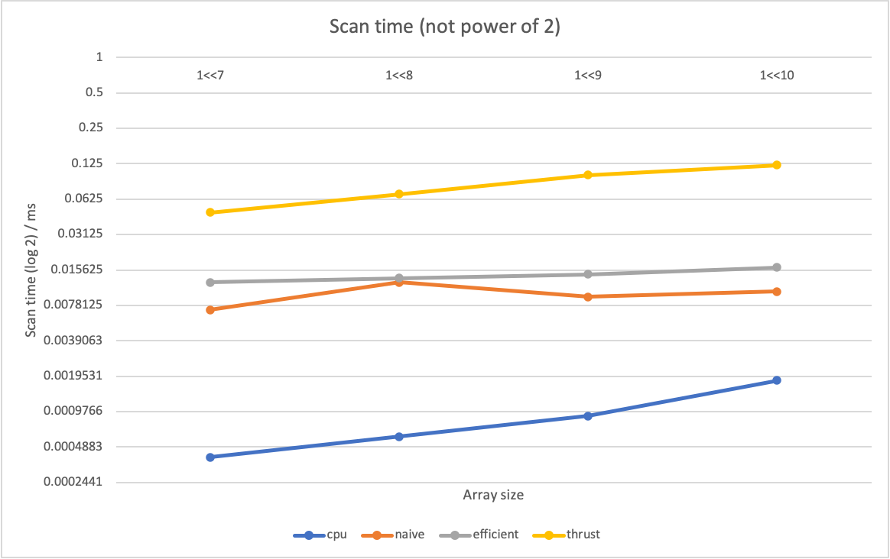

CUDA Stream Compaction
======================

**University of Pennsylvania, CIS 565: GPU Programming and Architecture, Project 2**

* Han Yan
* Tested on: CETS Virtual Lab

### Questions and Plots
Plots for varying array size. The scan time is shown in log 2 scale.




Analysis:
* For all array sizes, the CPU approach takes less time than GPU approaches. Among the GPU approaches, the naive implementation somehow takes less time. In terms of trend, the CPU approach is more susceptible to increasing array size (with larger slope), whereas both GPU methods are less susceptible - this is expected because the time complexity of CPU approach is O(n) and GPU approaches is O(log(n)). 

* I expected both the naive and work efficient scans to be faster than simple gpu scan, but this is not the case for my implementation. I think a bottleneck here for both naive and work efficient scan could be global memory I/O, since I'm storing all arrays in the device global memory. And both naive and efficient algorithms have global memory access in every level of iteration.

* I also expected the efficient scan to be faster than the naive scan. One factor that potentially slows down the efficient scan is the invocation of "__syncthreads()" in each level of up/down sweep. But in most levels, many threads don't really contribute any work.

* In thrust exclusive_scan implementation, I think it first does some memory copy, and then do the computation.

### Test Program Output

Array size = 1 << 8

```
****************
** SCAN TESTS **
****************
    [  22   1  25  15   7  27  27  23  12   1  49  11  46 ...  19   0 ]
==== cpu scan, power-of-two ====
   elapsed time: 0.0005ms    (std::chrono Measured)
    [   0  22  23  48  63  70  97 124 147 159 160 209 220 ... 6133 6152 ]
==== cpu scan, non-power-of-two ====
   elapsed time: 0.0005ms    (std::chrono Measured)
    [   0  22  23  48  63  70  97 124 147 159 160 209 220 ... 6088 6092 ]
    passed
==== naive scan, power-of-two ====
   elapsed time: 0.009216ms    (CUDA Measured)
    passed
==== naive scan, non-power-of-two ====
   elapsed time: 0.008192ms    (CUDA Measured)
    passed
==== work-efficient scan, power-of-two ====
   elapsed time: 0.013312ms    (CUDA Measured)
    passed
==== work-efficient scan, non-power-of-two ====
   elapsed time: 0.012288ms    (CUDA Measured)
    passed
==== thrust scan, power-of-two ====
   elapsed time: 0.091968ms    (CUDA Measured)
    passed
==== thrust scan, non-power-of-two ====
   elapsed time: 0.053248ms    (CUDA Measured)
    passed

*****************************
** STREAM COMPACTION TESTS **
*****************************
    [   0   1   3   3   3   3   1   3   0   3   3   3   2 ...   1   0 ]
==== cpu compact without scan, power-of-two ====
   elapsed time: 0.0008ms    (std::chrono Measured)
    [   1   3   3   3   3   1   3   3   3   3   2   1   1 ...   3   1 ]
    passed
==== cpu compact without scan, non-power-of-two ====
   elapsed time: 0.0012ms    (std::chrono Measured)
    [   1   3   3   3   3   1   3   3   3   3   2   1   1 ...   3   2 ]
    passed
==== cpu compact with scan ====
   elapsed time: 0.0077ms    (std::chrono Measured)
    [   1   3   3   3   3   1   3   3   3   3   2   1   1 ...   3   1 ]
    passed
==== work-efficient compact, power-of-two ====
   elapsed time: 0.017408ms    (CUDA Measured)
    passed
==== work-efficient compact, non-power-of-two ====
   elapsed time: 0.017408ms    (CUDA Measured)
    passed
```
