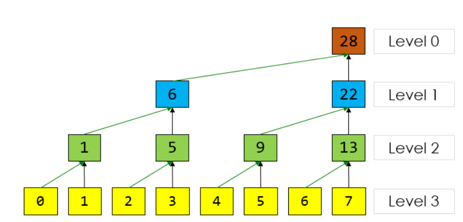
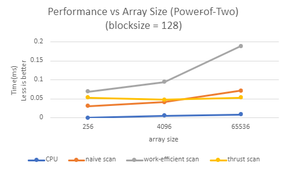

CUDA Stream Compaction
======================

**University of Pennsylvania, CIS 565: GPU Programming and Architecture, Project 2**

* Keyi Yu
  * [LinkedIn](https://www.linkedin.com/in/keyi-linda-yu-8b1178137/)
* Tested on: Windows 10, i7-10750H @ 2.60GHz 16GB, GeForce RTX 2070 with Max-Q 8228MB (My Machine)

Project2-Stream Compaction
=====================================

In this project, I implemented Scan(Prefix Sum) in both CPU and GPU versions, and GPU stream compaction in CUDA from scratch. Then I did some tests on both power-of-two-sized arrays and non-power-of-two-sized arrays. These algorithms are widely used and will be important for accelerating path tracer later on.


Contects
-------------------------------------
- [Introduction](#Introduction)
- [Scan](#Scan)
  - [Method1: CPU](#Method1:-CPU)
  - [Method2: Naive](#Method2:-Naive-GPU)
  - [Method3: Work Efficient](#Method3:-Work-Efficient-GPU)
- [Stream Compaction](#Stream-Compaction)
  - [Method1: CPU](#Method1:-CPU)
  - [Method2: Work Efficient](#Method3:-Work-Efficient-GPU)
- [Performance Analysis](#Performance-Analysis)
- [Debug](#Debug)
- [Questions](#Questions)
- [Extra Credit](#Extra-Credit)
- [Reference](#Reference)

Introduction
-------------------------------------
A simple and common parallel algorithm building block is the all-prefix-sums operation. The all-prefix-sums operation on an array of data is commonly known as scan. There are many uses for scan, including sorting, lexical analysis, string comparison and etc. (Reference from [NVIDIA GPU Gem3](https://developer.nvidia.com/gpugems/GPUGems3/gpugems3_ch39.html)) In this project, I implemented stream compaction with the scan operation.

Scan
-------------------------------------
Scan has two types: exlusive scan and inclusive scan. An exlusive scan can be generated from inclusive scan by shifting the array right by one element and inerting the identity. In this project, I implemented exclusive scan.

### Method1: CPU
The idea of implementing scan on CPU is very straightforward. I used a for loop to iterate the array and add each entry to the previous sum. The prefixSum represents the sum of the previous i entries. So prefixSum[0] = 0. In this way, the result of the prefixSum is the exclusive scan. The pesudo code is:
```
for each entry arr[i] in arr from [0, n - 1]:
    prefixSum[i] = arr[i - 1] + prefixSum[i - 1]
```

### Method2: Navie GPU
This method is similar to parallel reduction. This algorithm is based on the scan algorithm presented by Hillis and Steele (1986) and demonstrated for GPUs by Horn (2005). Figure below shows the procedure. 

We can notice that this method performs O(nlogn) addition operations. Recall that Method1 only performs O(n) addition operaions. Therefore, this naive scan is not work-efficient. 

Another problem of the peusdo code shown in the picture is that in-place algorithm doesn't work if the array size is larger than the warp size(warp size is 32 in G80). So we have to use two arrays: input array and output array. At each iteration, we will do the add operation and store the results in the output array. In the next iteration, the previous output array will be the input array and so on and so forth. Peusdo code in [Example 2](#img/example-2.jpg) shows this idea.


### Method3: Work Efficient GPU
This algorithm is based on the one presented by Blelloch (1990). The idea is to build a balanced binary tree on the input data and sweep it to and from the root to compute the prefix sum. 

Step1: Up Sweep


Step2: Down Sweep


Stream Compaction
-------------------------------------
### Method1: CPU
This method is to iterate the array and select those we want.
```
for each entry arr[i] from arr in range[0, n - 1]:
    if arr[i] == 1
        Add it to the result arr
    else
        do nothing
```
### Method2: Work-efficient GPU
With the work-efficient scan implemented above, it is easy to implement this algorithm. This algoeithm has three steps:

1. In parallel, determine whether each entry is 0 or not. 
```
if entry arr[i] == 0:
    map[i] = 0;
else:
    map[i] = 1;
``` 

2. Use work-efficient scan on the map array in step1 to get exclusive scan result.
3. In parallel, write the non-zero entry i to the output array with index map[i]

## Performance Analysis and Questions
### Roughly optimize the block sizes of each of your implementations for minimal run time on your GPU.
I changed the blocksize when the array size was 2^20. The figure below shows the performance of three algorithms with different blocksize. As we can see, when the blocksize is 128, 256, and 512, the three methods all perform better. So I choose 128 as the blocksize for my following analysis.


### Compare all of these GPU Scan implementations (Naive, Work-Efficient, and Thrust) to the serial CPU version of Scan. Plot a graph of the comparison (with array size on the independent axis).
Here are some graphs and output showing the performance of the four methods mentioned above.
1. Performance vs Array size (Power-of-Two)

Large range            |  Small range
:-------------------------:|:-------------------------:
 | 


2. Performance vs Array size (Non-Power-of-Two)

Large range            |  Small range
:-------------------------:|:-------------------------:
 | 

The array size greatly affected the performance of the four algorithms. When the data size is small(i.e. 256 or 65536), CPU performs better than the GPU algorithms. However, as the size of the array increases, GPU performs better than(up to 10 times) the CPU.

I read the Nsight performance analysis and noticed that there is still memory transfer from host to device or device to host. As the size of the array increases, CPU costs much more time to compute and thus those memory transfer time is negligible. Also there is a cudaCreateEvent call, which may cost some time. I think these time cost would be the bottleneck of the gpu algorithms, even for the thrust libaray implementation.

3. POT vs NPOT

 

The figure shows the performance of thrust::exclusive_scan on Power-of-Two array and Non-Power-of-Two array. The result is expected because we need to pad 0 to the NPOT before UpSweep operation, which will cost extra time and memory. I guess the reason why the performance is quite close is that the size of the NPOT array is slightly smaller that the size of POT array. 


4. Output in CMD
```
****************
** SCAN TESTS **
****************
    [   0  30  45  48  26  27  21  49  46  22  34  10  47 ...  17   0 ]
==== cpu scan, power-of-two ====
   elapsed time: 4.3786ms    (std::chrono Measured)
    [   0   0  30  75 123 149 176 197 246 292 314 348 358 ... 25686177 25686194 ]
==== cpu scan, non-power-of-two ====
   elapsed time: 1.4756ms    (std::chrono Measured)
    [   0   0  30  75 123 149 176 197 246 292 314 348 358 ... 25686095 25686126 ]
    passed
==== naive scan, power-of-two ====
   elapsed time: 0.7624ms    (CUDA Measured)
    passed
==== naive scan, non-power-of-two ====
   elapsed time: 0.76464ms    (CUDA Measured)
    passed
==== work-efficient scan, power-of-two ====
   elapsed time: 1.03267ms    (CUDA Measured)
    passed
==== work-efficient scan, non-power-of-two ====
   elapsed time: 1.03699ms    (CUDA Measured)
    passed
==== thrust scan, power-of-two ====
   elapsed time: 0.196608ms    (CUDA Measured)
    passed
==== thrust scan, non-power-of-two ====
   elapsed time: 0.211552ms    (CUDA Measured)
    passed

*****************************
** STREAM COMPACTION TESTS **
*****************************
    [   2   2   1   0   0   1   1   3   0   0   2   0   1 ...   3   0 ]
==== cpu compact without scan, power-of-two ====
   elapsed time: 2.3306ms    (std::chrono Measured)
    [   2   2   1   1   1   3   2   1   1   2   3   2   2 ...   1   3 ]
    passed
==== cpu compact without scan, non-power-of-two ====
   elapsed time: 2.3035ms    (std::chrono Measured)
    [   2   2   1   1   1   3   2   1   1   2   3   2   2 ...   1   1 ]
    passed
==== cpu compact with scan ====
   elapsed time: 9.6631ms    (std::chrono Measured)
    [   2   2   1   1   1   3   2   1   1   2   3   2   2 ...   1   3 ]
    passed
==== work-efficient compact, power-of-two ====
   elapsed time: 1.14995ms    (CUDA Measured)
    passed
==== work-efficient compact, non-power-of-two ====
   elapsed time: 1.15507ms    (CUDA Measured)
    passed
```


## Debug
1. Navie Scan

- I ping-pong buffers to keep arr1 as the input data and arr2 as the output data. But I found it inefficient. So I use a flag to denote which one is the input arr at each iteration.
- I need to determine which array is the final result. At first, I thought dev_arr2 will always be the result. But as I change the array size, dev_arr1 and dev_arr2 are both possible answers.

2. Efficient scan: My program works well with array size < 16 but crashed with array size >= 16. Error: Illigal memory
- Bug1: I forget to free the device buffers.
- Bug2(Main problem): Firstly, I try to avoid module operations when implementing the kernUpSweep and kernDownSweep. Unluckily, it looks like my implementation has problems. So I still use mod operation to determine whether the current thread should do the calculations.

## Extra Credit
1. Improve performance of work-efficient scan

   The work-efficient scan performs worse than the naive scan. Because more and more threads become lazy after several iterations, we need to choose the proper number of threads at each iteration.

   So we need a mapping from the threadId to the array index. 
   ```
      compute the # of number changed at each iteration, stride, start index
      threadId is from 0 to NumberChangedAtEachIteration
      array index  = threadId * strideAtEachIteration + startIndexAtEachIteration
   ```
   Number of threads needed each time is greatly reduced by doing so. Obviously, the performance is much better than the previous version. But there is still a gap between the optimized method and thrust exslusive scan. I think maybe I can use the optimization method mentioned in CUDA Performance class and use shared memory.
```
****************
** SCAN TESTS **
****************
    [  32  37  45  13   5   4  16  28  34   3  47   5  21 ...  45   0 ]
==== cpu scan, power-of-two ====
   elapsed time: 65.1664ms    (std::chrono Measured)
    [   0  32  69 114 127 132 136 152 180 214 217 264 269 ... 410887714 410887759 ]
==== cpu scan, non-power-of-two ====
   elapsed time: 24.5645ms    (std::chrono Measured)
    [   0  32  69 114 127 132 136 152 180 214 217 264 269 ... 410887594 410887640 ]
    passed
==== naive scan, power-of-two ====
   elapsed time: 13.1808ms    (CUDA Measured)
    passed
==== naive scan, non-power-of-two ====
   elapsed time: 13.1909ms    (CUDA Measured)
    passed
==== work-efficient scan, power-of-two ====
   elapsed time: 17.7448ms    (CUDA Measured)
    passed
==== work-efficient scan, non-power-of-two ====
   elapsed time: 17.7584ms    (CUDA Measured)
    passed
==== thrust scan, power-of-two ====
   elapsed time: 0.685632ms    (CUDA Measured)
    passed
==== thrust scan, non-power-of-two ====
   elapsed time: 0.69632ms    (CUDA Measured)
    passed
==== work-efficient scan optimized, power-of-two ====
   elapsed time: 5.94595ms    (CUDA Measured)
    passed
==== work-efficient scan optimized, non-power-of-two ====
   elapsed time: 5.95277ms    (CUDA Measured)
    passed

```

## Reference

1. [Parallel Algotithms Slides](#https://onedrive.live.com/view.aspx?resid=A6B78147D66DD722!95162&ithint=file%2cpptx&authkey=!AFs_WCO3UbQLC40)
2. [NVIDIA GPU Gem3](https://developer.nvidia.com/gpugems/GPUGems3/gpugems3_ch39.html)
