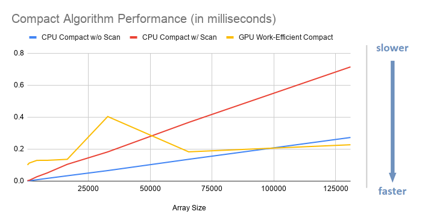

CUDA Stream Compaction
======================

**University of Pennsylvania, CIS 565: GPU Programming and Architecture, Project 2**

* Janine Liu
  * [LinkedIn](https://www.linkedin.com/in/liujanine/), [personal website](https://www.janineliu.com/).
* Tested on: Windows 10, i7-10750H CPU @ 2.60GHz 16GB, GeForce RTX 2070 8192 MB (personal computer)

### GPU Stream Compaction

This project involved implementing Scan and Compact algorithms that will be used for in later projects, comparing their performance on both the GPU and CPU with different array sizes. In detail, this project includes:
* a CPU version of Scan,
* a CPU version of Compact without using the Scan algorithm,
* a CPU version of Compact with Scan,
* a naive version of Scan,
* a work-efficient version of Scan, and
* a work-efficient version of Compact that used the work-efficient Scan's code.

All three CPU algorithms are serialized; no multi-threading was incorporated. The Thrust library's version of Scan is also compared with the rest of these algorithms as an additional reference. 

## Performance Analysis Methods

The CPU and GPU algorithms were timed during their execution, and their times are written to a formatted output that is printed to the terminal. An example of that output is as follows:

```
****************
** SCAN TESTS **
****************
    [  18  44  40  43   2  39  23  12   8   5  11  16  31 ...   5   0 ]
==== cpu scan, power-of-two ====
   elapsed time: 0.008ms    (std::chrono Measured)
    [   0  18  62 102 145 147 186 209 221 229 234 245 261 ... 100690 100695 ]
==== cpu scan, non-power-of-two ====
   elapsed time: 0.0069ms    (std::chrono Measured)
    passed
==== naive scan, power-of-two ====
   elapsed time: 0.04208ms    (CUDA Measured)
    [   0  18  62 102 145 147 186 209 221 229 234 245 261 ... 100690 100695 ]
    passed
==== naive scan, non-power-of-two ====
   elapsed time: 0.038656ms    (CUDA Measured)
    passed
==== work-efficient scan, power-of-two ====
   elapsed time: 0.093504ms    (CUDA Measured)
    passed
==== work-efficient scan, non-power-of-two ====
   elapsed time: 0.083968ms    (CUDA Measured)
    passed
==== thrust scan, power-of-two ====
   elapsed time: 0.04832ms    (CUDA Measured)
    passed
==== thrust scan, non-power-of-two ====
   elapsed time: 0.04752ms    (CUDA Measured)
    passed

*****************************
** STREAM COMPACTION TESTS **
*****************************
    [   0   2   2   3   2   3   1   2   0   1   3   2   1 ...   1   0 ]
==== cpu compact without scan, power-of-two ====
   elapsed time: 0.0082ms    (std::chrono Measured)
    [   2   2   3   2   3   1   2   1   3   2   1   3   3 ...   2   1 ]
    passed
==== cpu compact without scan, non-power-of-two ====
   elapsed time: 0.0082ms    (std::chrono Measured)
    [   2   2   3   2   3   1   2   1   3   2   1   3   3 ...   1   1 ]
    passed
==== cpu compact with scan ====
   elapsed time: 0.0287ms    (std::chrono Measured)
    [   2   2   3   2   3   1   2   1   3   2   1   3   3 ...   2   1 ]
    passed
==== work-efficient compact, power-of-two ====
   elapsed time: 0.124928ms    (CUDA Measured)
    [   2   2   3   2   3   1   2   1   3   2   1   3   3 ...   2   1 ]
    passed
==== work-efficient compact, non-power-of-two ====
   elapsed time: 0.122176ms    (CUDA Measured)
    passed
```

To collect data, I ran the program five times in succession and record the time values displayed for the "power-of-two" arrays in each implementation. In each run, the program generates a new array of random values for all of the algorithms operate on, so the data input is consistent across timings. I varied the size of the arrays by powers of two, starting from 256. While I did not formally record values for the non power-of-two arrays, I observed on their values and noted when there were any outliers.

## Scan Runtime Analysis

The performance of the four scan functions is graphed below.


* Initially, the GPU implementations of Scan seemed much slower than the CPU implementation, since they were tested on an array size of 256 and the CPU's base speed is extremely fast. However, once the array size was increased exponentially, the performance of both GPU implementations slowly approached the CPU one in numerical speed, even surpassing it for an array of 131,072.
* The CPU's performance experiences a **38,932%** speed decrease from an array of 256 to the array of 131,072, while the Naive GPU Scan experiences a **199%** decrease and the Work-Efficient one experiences a **343%** decrease respectively.
* On the graph, the CPU has a linear trajectory, while both the Naive and Work-Efficient Scans have a log(n) trajectory; if more array sizes were tested, this predicts that both GPU implementations will be faster than the CPU's, where the larger the array size, the more efficient the GPU implementations are.

Unfortunately, despite intentions and expectations, the Work-Efficient Scan is less efficient than the Naive Scan. It has a higher base speed, and the slope of its graph is higher than that of the Naive Scan's. The implementation of Work-Efficient Scan involves two `for` loops, one for the "up-sweep" of the initial array and one for the "down-sweep" on the result, and thus twice as many kernel calls. Commenting out one of these `for` loops causes Work-Efficient Scan to be slightly faster than Naive Scan (although wrong, of course), which implies that the presence of two `for` loops makes the implementation slow. I confirmed this when I looked at the kernels' runtime through the NSight Analysis interface:


The total kernel run-time of Work-Efficient Scan is about two times that of Naive Scan, so Work-Efficient Scan takes twice as much time. This is a problem with the lack of optimization in the kernel calls; the kernels are not efficient enough to balance out the fact that there are twice as many calls. 

Interestingly, the Thrust Scan's performance stays relatively the same no matter what. I could not find it on NSight's Timeline, even when it was the only function being called, so I cannot genuinely analyze its performance or hypothesize why it's so consistent.

## Compact Runtime Analysis

The performance of the three compact functions is graphed below.



These results align with the observations found in the Scan part of this project.

* As with the Scan implementations, the GPU implementation at array size 256 is slower than the CPU implementation, but proves to be more efficient as the array size increases, performing faster than both CPU implementations with an array size of 131,072.
* During Compact without Scan on an array of 131,072 the CPU experiences a **45,400%** decrease in performance compared to its speed at array size 256, while Compact with Scan performs at **24539%** worse than its base speed. This contrasts the **124%** change in performance observed in the Work-Efficient Compact function.
* Aside from the fluctuation in the graph, the function of the Work-Efficient Compact follows a log(n) trajectory with a very small slope. This contrasts the linear trajectories of both CPU implementations, in a way that is similarly demnonstrated in Scan.

As a whole, even though the base speeds of these work-efficient algorithms are high, they diverge less rapidly from these speeds than their CPU counterparts and outperform them when applied to larger sets of data.

## Outliers

While I was collecting data, I observed some abnormal values throughout the program that appeared and disappeared with program refreshes. For some sizes of the randomly-generated array, the algorithms produce fluctuating values that interfere with the expected trajectory of data from their functions. A notable example happens with the cases of Thrust Scan: when I tested an array size of 1021 with block size 128 during my implementation process, the Thrust Scan showed a value of 0.231424, five times slower than its expected average speed. It showed something similar at array size 32,768, spiking again to some value between 0.20 and 0.25ms, equivalent in magnitude to the other lag spike. There was also some interference with the Work-Efficient Scan and Compact algorithms, especially the Work_Efficient Contact. The most out-of-place value I observed was a performance of 0.81392 ms at array size 32,768. Though this instability explains the fluctuation in the slopes of their graphs, I cannot think of an explanation for why this happens, because the size of the array stays constant (and subsequent trials will show expected results). 

## Block Size Optimization

The process to optimize block size was very informal; I ran the program a number of times and eyeballed the difference in values that resulted from different block sizes (though some changes were indiscernable). My testing values for the block size ranged from 32 to 512; these end values were inefficient and it did not make sense to continue testing in either extreme direction.

* There was a notable difference in performance between block sizes 32 and 64; with an array size of 32,768 and a block size of 32, the Work-Efficient Scan was slower by 0.1ms than its speed with block size 64.
* It was difficult to sense a difference between block sizes 64 and 128.
* A block size of 256 seems to make work efficient scan faster, dropping by 0.2ms on avergae, but slightly taxes work compact 0.1-0.2ms.
* There is much more performance fluctuation with 512, causing the Work-Efficient Scan and Compact to lag abnormally. Therefore, it is unideal for our algorithms.
