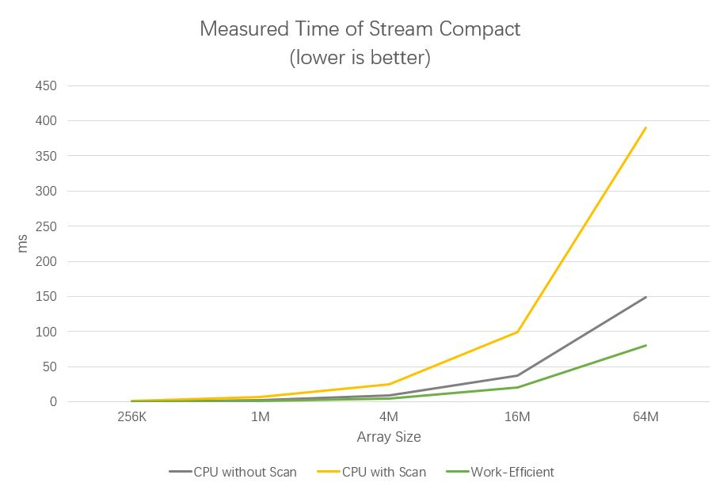

CUDA Stream Compaction
======================

**University of Pennsylvania, CIS 565: GPU Programming and Architecture, Project 2**

* Jilin Liu
  * [LinkedIn](https://www.linkedin.com/in/jilin-liu-61b273192/), [twitter](https://twitter.com/Jilin18043110).
* Tested on: Windows 10, i7-8750H @ 2.20GHz, 16GB, GTX 1050Ti 4096MB (personal)

## Features and Results

This project includes several parallel algorithms such as exclusive scan and stream compaction. These algorithms can be very useful as independent components of later projects like GPU based path tracer. A serial CPU version of these algorithms is also implemented and used as a performance comparison baseline.

Features:
1. CPU Scan
2. CPU Stream Compact
3. Naive GPU Scan
4. Work-Efficient Scan
5. Work-Efficient Stream Compact

Extra Credit:
1. Faster GPU Implementation

```
****************
** SCAN TESTS **
****************
    [  30  44  27  31   9  34  15  27  24  39  44  33  38 ...  18   0 ]
==== cpu scan, power-of-two ====
   elapsed time: 17.3105ms    (std::chrono Measured)
    [   0  30  74 101 132 141 175 190 217 241 280 324 357 ... 102764441 102764459 ]
==== cpu scan, non-power-of-two ====
   elapsed time: 2.102ms    (std::chrono Measured)
    [   0  30  74 101 132 141 175 190 217 241 280 324 357 ... 102764362 102764372 ]
    passed
==== naive scan, power-of-two ====
   elapsed time: 8.62189ms    (CUDA Measured)
    passed
==== naive scan, non-power-of-two ====
   elapsed time: 8.62202ms    (CUDA Measured)
    passed
==== work-efficient scan, power-of-two ====
   elapsed time: 3.79942ms    (CUDA Measured)
    passed
==== work-efficient scan, non-power-of-two ====
   elapsed time: 3.77037ms    (CUDA Measured)
    passed
==== thrust scan, power-of-two ====
   elapsed time: 0.560736ms    (CUDA Measured)
    passed
==== thrust scan, non-power-of-two ====
   elapsed time: 0.639808ms    (CUDA Measured)
    passed

*****************************
** STREAM COMPACTION TESTS **
*****************************
    [   0   0   1   3   3   0   1   1   2   3   0   3   2 ...   0   0 ]
==== cpu compact without scan, power-of-two ====
   elapsed time: 9.2661ms    (std::chrono Measured)
    [   1   3   3   1   1   2   3   3   2   3   2   3   3 ...   2   3 ]
    passed
==== cpu compact without scan, non-power-of-two ====
   elapsed time: 9.253ms    (std::chrono Measured)
    [   1   3   3   1   1   2   3   3   2   3   2   3   3 ...   2   2 ]
    passed
==== cpu compact with scan ====
   elapsed time: 24.8881ms    (std::chrono Measured)
    [   1   3   3   1   1   2   3   3   2   3   2   3   3 ...   2   3 ]
    passed
==== work-efficient compact, power-of-two ====
   elapsed time: 5.13638ms    (CUDA Measured)
    passed
==== work-efficient compact, non-power-of-two ====
   elapsed time: 5.15882ms    (CUDA Measured)
    passed
```

## Performance Analysis

A more detailed performance comparison of exclusive scan with respect to the array size is shown below.




The thrust implementation has the best scalability and runs about 10 times faster than my work-efficient scan. But its execution time still follows a linear increase with respect to the array size. My hypothesis about its efficiency is that it's using shared memory.

In the timeline below, we can easily spot the bottleneck of my implementation. As I precluded the time measurement of device-to-host and host-to-device memory copy, the majority execution time comes from the calling of up-sweep kernel function and down-sweep kernel function. The up-sweep and down-sweep in total take 5 times longer than scatter and 10 times longer than map-to-boolean.


The thrust scan seems to have two stage as well, as you can see below. But there is an noticable gap between two kernel functions. My guess is that they are packing memory into shared memories so the access can be much faster.


In each step of up-sweep and down-sweep, I only used those threads that are necessary to the algorithm. Since in each step we are only accessing and modifying a subset of the array elements, so the number of threads we need is proportional to the size of this subset. This trick eliminates a large number of lazy threads and thus makes the program run faster.

When the array has a trivial size, i.e. 256 elements, the CPU version runs faster(even faster than thrust implementation). The reason is that GPU has a overhead of packing and scheduling threads, which overweighs the benefits from parrallelism when the array size is small, as you can see below.

```
****************
** SCAN TESTS **
****************
    [  38  13  31  10  45   3  41  44  26  12  44  28  12 ...  10   0 ]
==== cpu scan, power-of-two ====
   elapsed time: 0.0005ms    (std::chrono Measured)
    [   0  38  51  82  92 137 140 181 225 251 263 307 335 ... 6247 6257 ]
==== cpu scan, non-power-of-two ====
   elapsed time: 0.0004ms    (std::chrono Measured)
    [   0  38  51  82  92 137 140 181 225 251 263 307 335 ... 6169 6198 ]
    passed
==== naive scan, power-of-two ====
   elapsed time: 0.017408ms    (CUDA Measured)
    passed
==== naive scan, non-power-of-two ====
   elapsed time: 0.017408ms    (CUDA Measured)
    passed
==== work-efficient scan, power-of-two ====
   elapsed time: 0.050176ms    (CUDA Measured)
    passed
==== work-efficient scan, non-power-of-two ====
   elapsed time: 0.044032ms    (CUDA Measured)
    passed
==== thrust scan, power-of-two ====
   elapsed time: 0.04448ms    (CUDA Measured)
    passed
==== thrust scan, non-power-of-two ====
   elapsed time: 0.041984ms    (CUDA Measured)
    passed
```


