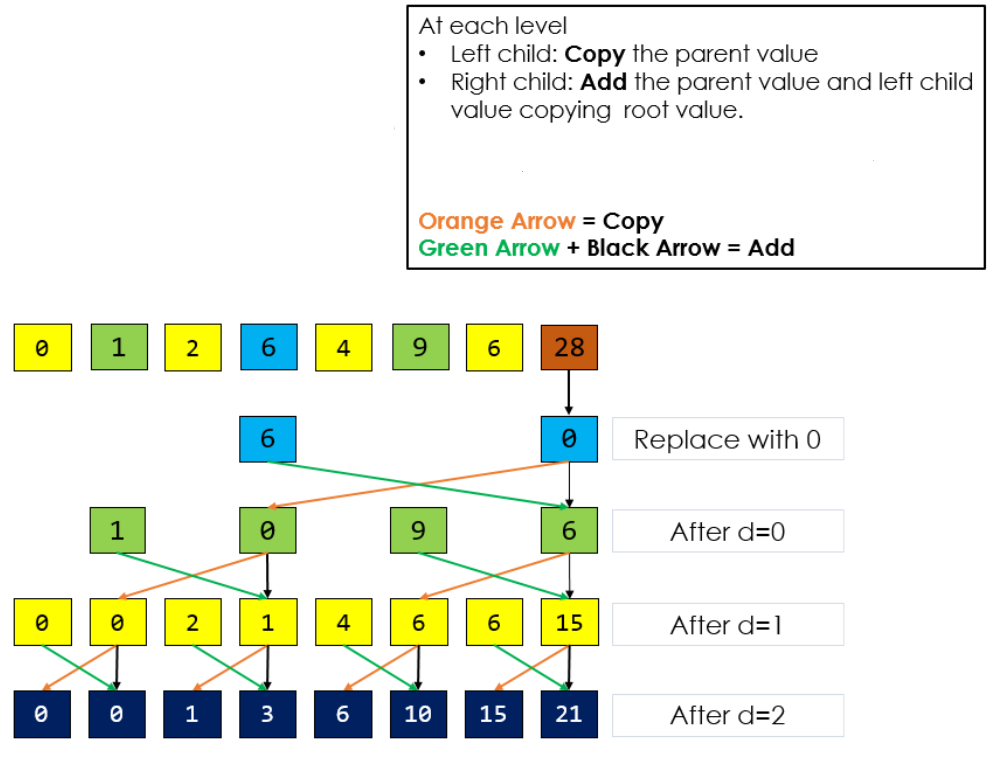
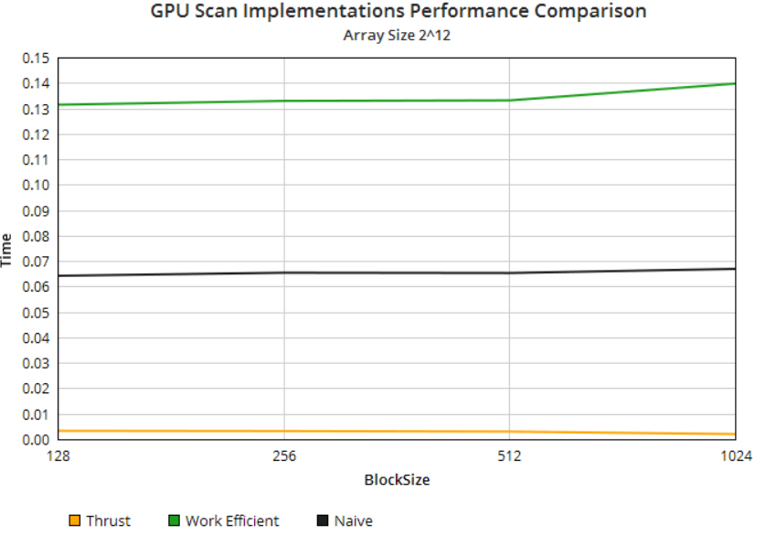
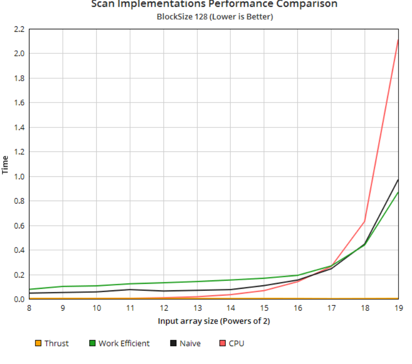

CUDA Stream Compaction
======================

**University of Pennsylvania, CIS 565: GPU Programming and Architecture, Project 2**

## SIREESHA PUTCHA 
	
*    [ LinkedIn ](https://www.linkedin.com/in/sireesha-putcha/)

*   [ Facebook ](https://www.facebook.com/sireesha.putcha98/)

*    [ Portfolio ](https://sites.google.com/view/sireeshaputcha/home)

*   [ Mail ](sireesha@seas.upenn.edu)


* Tested on personal computer - Microsoft Windows 10 Pro, 
Processor : Intel(R) Core(TM) i7-9750H CPU @ 2.60GHz, 2601 Mhz, 6 Core(s), 12 Logical Processor(s)
 
GPU : NVIDIA GeForce RTX 2060

## OUTPUT 
* SCAN 


* STREAM COMPACTION 


# ALGORITHM OVERVIEW 

GPU stream compaction in CUDA from scratch. This algorithm is widely used. 

Stream compaction implementations in this project will simply remove `0`s
from an array of `int`s.

This project is meant to reorient our algorithmic thinking to the way of the GPU. On GPUs, many
algorithms can benefit from massive parallelism and, in particular, data
parallelism: executing the same code many times simultaneously with different
data.

Implementations include a few different versions of the *Scan* (*Prefix Sum*)
algorithm. First, is an implemention of a CPU version of the algorithm. Then, there are the GPU implementations: "naive" and
"work-efficient." Finally, these implementations are used in GPU stream compaction.

**References**
* The [slides on Parallel Algorithms](https://docs.google.com/presentation/d/1ETVONA7QDM-WqsEj4qVOGD6Kura5I6E9yqH-7krnwZ0/edit#slide=id.p126)
  for Scan, Stream Compaction, and Work-Efficient Parallel Scan.
* GPU Gems 3, Chapter 39 - [Parallel Prefix Sum (Scan) with CUDA](https://developer.nvidia.com/gpugems/GPUGems3/gpugems3_ch39.html).
    - This online version contains a few small errors (in superscripting, missing braces, bad indentation, etc.)
    - We maintain a fix for this at [GPU Gem 3 Ch 39 Patch](https://github.com/CIS565-Fall-2017/Project2-Stream-Compaction/blob/master/INSTRUCTION.md#gpu-gem-3-ch-39-patch). 
* [Algorithm Examples](https://github.com/CIS565-Fall-2017/Project2-Stream-Compaction/blob/master/INSTRUCTION.md#algorithm-examples).
* [Recitation slides](https://docs.google.com/presentation/d/1daOnWHOjMp1sIqMdVsNnvEU1UYynKcEMARc_W6bGnqE/edit?usp=sharing)

The GPU stream compaction implementation lives inside of the `stream_compaction` subproject. .


## Scan : 
This is also called All Prefix Sum. 


There are 2 types of scans : 

* Exclusive scan : Elem j of the result does not include elem j of input. 

* Inclusive Scan : All elements including j are summed up and output in the j element. 


### Ways to implement Scan 

1) Naive Parallel Scan: In this, each thread writes one sum and reads two values 


2) Work Efficient Parallel Scan : This scan uses a balanced binary tree concept. There are 2 phases in this scan. 

- Upsweep : This phase is similar to parallel reduction. The sum of all elements is stored in the last element. 


- Downsweep : Traverse back down the tree using partial sums. 



## Stream Compaction: 
Given an array, create a new array of elements that meet a certain criteria. There are 3 steps in this process: 

1) Compute a temporary array with 0s and 1s based on the given condition. 

2) Run and exclusive scan on this temporary array. 

3) Scatter the elements. Use the result of scan as an index to write to the final output array if the value for that element is 1 in the temporary array. 


## Algorithm Examples

* Scan:
  - goal: produce a prefix sum array of a given array (we only care about exclusive scan here)
  - input
    - [1 5 0 1 2 0 3]
  - output
    - [0 1 6 6 7 9 9]
* Stream Compaction:
  - goal: closely and neatly packed the elements != 0
  - input
    - [1 5 0 1 2 0 3]
  - output
    - [1 5 1 2 3]
* compactWithoutScan (CPU)
  - an implementation of compact. So the goal, input and output should all be the same as compact
  - Simply loop through the input array, meanwhile maintain a pointer indicating which address shall we put the next non-zero element
* compactWithScan (CPU/GPU)
  - an implementation of compact. So the goal, input and output should all be the same as compact
  - 3 steps
    - map
      + goal: map our original data array (integer, Light Ray, etc) to a bool array
      + input
        - [1 5 0 1 2 0 3]
      + output
        - [1 1 0 1 1 0 1]
    - scan
        + take the output of last step as input
        + input
          - [1 1 0 1 1 0 1]
        + output
          - [0 1 2 2 3 4 4]
    - scatter
        + preserve non-zero elements and compact them into a new array
        + input:
          + original array
            - [1 5 0 1 2 0 3]
          + mapped array
            - [1 1 0 1 1 0 1]
          + scanned array
            - [0 1 2 2 3 4 4]
        + output:
          - [1 5 1 2 3]
        + This can be done in parallel on GPU
        + You can try multi-threading on CPU if you want (not required and not our focus)
        + for each element input[i] in original array
          - if it's non-zero (given by mapped array)
          - then put it at output[index], where index = scanned[i]

# PROJECT OVERVIEW 

1) CPU Scan and Stream compaction Implementation 
`stream_compaction/cpu.cu`:

* `StreamCompaction::CPU::scan`: compute an exclusive prefix sum. For performance comparison.
* `StreamCompaction::CPU::compactWithoutScan`: stream compaction without using
  the `scan` function.
* `StreamCompaction::CPU::compactWithScan`: stream compaction using the `scan`
  function. Map the input array to an array of 0s and 1s, scan it, and use
  scatter to produce the output.

2) Thrust Implementation for Scan : 

Performed a scan using thrust::exclusive_scan(first, last, result)

3) Naive GPU Scan :

Finding the exclusive scan for the given elements in an array. Each time, we increment the loop by raising the depth by a power of 2. 
We compute the inclusive scan first by adding the previous output in the array to the previous input element to compute the result for the current element. 
We then convert this to an exclusive scan by setting the first element in the output array to zero and shifting the rest of the elements to the right. 
We perform this by using ping-pong buffers. 

4) Work Efficient GPU Scan :

We perform a work efficient scan on the gpu based on the binary tree model discussed above. We first pad zeros to the end of an array if it is not the size of power of 2. 
Then we perform Upsweep which is equivalent to parallel reduction. We set the last element to zero before performing downsweep where we traverse down the tree. 

# PERFORMANCE ANALYSIS 

## Analysis 

* Performance comparision between GPU Scan implementations (Naive, Work-Efficient, and Thrust) to the serial CPU version of Scan with BlockSize on the x axis. 
  Array Size used: 2^12, time is in seconds. (Lower is better). The optimal Blocksize is 128 for my system.



* Performance comparision between GPU Scan implementations (Naive, Work-Efficient, and Thrust) to the serial CPU version of Scan with array size on the x axis. 
  BlockSize used :128, time is in seconds.




* Write a brief explanation of the phenomena you see here.

As we compare the four different approaches(Naive, Work-Efficient, Thrust and CPU), it is evident that the thrust method gives the best results. 
The cpu implementation works very efficiently for smaller sizes of input array but
as the size gets bigger (2^19), we see that it gives the worst performance of the four. Thrust is very consistent with the different input array sized used. 
It gives a 0.003-0.004 second output even with an array size of 2^19. The naive implementation gives better results compared to the work efficient implementation for 
smaller array sizes but the work efficient is best for bigger array sizes. This is because of the fact that with smaller array sizes, a lot of threads are unused but as input
size increases, it becomes more efficient. As for Naive, the complexity is increasing since the amount of additions done are doubling with the input size since the time complexity
is of the order O(nlog(n)).
  
* Can you find the performance bottlenecks? Is it memory I/O? Computation? Is
    it different for each implementation?

A performance bottleneck for the GPU implementations in general is the usage of global memory. Global memory read/writes are expensive and take upto 20 cycles per instruction. 
An optimization that can be used in this case is shared memory. Instead of creating device buffers on global memory, if we store the input data in shared memory (for which read/write take only 2 cycles),
we can see an improvement in the time taken for work efficient scan. For Naive, the additional bottleneck would be increase in the size of input array. 

## Output 

Array Size used : 2^12. Blocksize used 128. 

```
****************
** SCAN TESTS **
****************
    [   6  33  12  21  45   1  15   6  16  34  19  17  46 ...  47   0 ]
==== cpu scan, power-of-two ====
   elapsed time: 0.0089ms    (std::chrono Measured)
    [   0   6  39  51  72 117 118 133 139 155 189 208 225 ... 100600 100647 ]
==== cpu scan, non-power-of-two ====
   elapsed time: 0.0087ms    (std::chrono Measured)
    [   0   6  39  51  72 117 118 133 139 155 189 208 225 ... 100491 100522 ]
    passed
==== naive scan, power-of-two ====
   elapsed time: 0.06496ms    (CUDA Measured)
    passed
==== naive scan, non-power-of-two ====
   elapsed time: 0.063104ms    (CUDA Measured)
    passed
==== work-efficient scan, power-of-two ====
   elapsed time: 0.129024ms    (CUDA Measured)
    [   0   6  39  51  72 117 118 133 139 155 189 208 225 ... 100600 100647 ]
    passed
==== work-efficient scan, non-power-of-two ====
   elapsed time: 0.129024ms    (CUDA Measured)
    [   0   6  39  51  72 117 118 133 139 155 189 208 225 ... 100491 100522 ]
    passed
==== thrust scan, power-of-two ====
   elapsed time: 0.003328ms    (CUDA Measured)
    passed
==== thrust scan, non-power-of-two ====
   elapsed time: 0.00336ms    (CUDA Measured)
    passed

*****************************
** STREAM COMPACTION TESTS **
*****************************
    [   3   0   2   2   2   3   2   3   2   2   1   3   3 ...   0   0 ]
==== cpu compact without scan, power-of-two ====
   elapsed time: 0.0197ms    (std::chrono Measured)
    [   3   2   2   2   3   2   3   2   2   1   3   3   3 ...   2   2 ]
    passed
==== cpu compact without scan, non-power-of-two ====
   elapsed time: 0.0195ms    (std::chrono Measured)
    [   3   2   2   2   3   2   3   2   2   1   3   3   3 ...   2   2 ]
    passed
==== cpu compact with scan ====
   elapsed time: 0.0535ms    (std::chrono Measured)
    [   3   2   2   2   3   2   3   2   2   1   3   3   3 ...   2   2 ]
    passed
==== work-efficient compact, power-of-two ====
Work Efficient SC count is 3091
   elapsed time: 0.374784ms    (CUDA Measured)
    [   3   2   2   2   3   2   3   2   2   1   3   3   3 ...   2   2 ]
    passed
==== work-efficient compact, non-power-of-two ====
Work Efficient SC count is 3091
   elapsed time: 0.433312ms    (CUDA Measured)
    [   3   2   2   2   3   2   3   2   2   1   3   3   3 ...   2   2 ]
    passed
``` 
 
