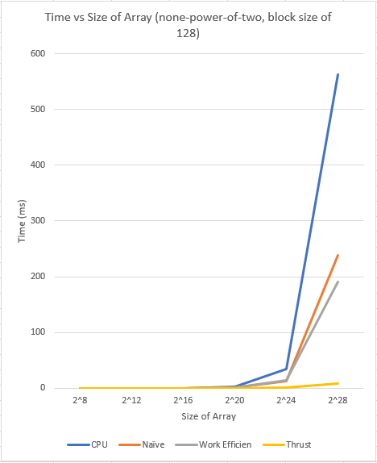

CUDA Stream Compaction
======================

**University of Pennsylvania, CIS 565: GPU Programming and Architecture, Project 2**

* Li Zheng
  * [LinkedIn](https://www.linkedin.com/in/li-zheng-1955ba169)
* Tested on: Windows CUDA10, i5-3600 @ 3.59GHz 16GB, RTX 2060 6GB (personal computer)

This project implements different versions of scan, including CPU scan, naive scan, work-efficient scan and thrust scan. Some of these methods are used to implement stream compaction. A timer is used to measure the time cost and evaluate the performance.

### Performance Analysis
  
This diagram demonstrates the change of time with respect to block size. The block size of 128 and 256 have relatively good performance.


  
The diagrams show the change of time with array size increases. The first diagram is for power-of-two size array. The second one is for non-power-of-two size array. Their performance is almost the same. When the array size is small, the CPU implementation has a better performance. I think it is because most of the threads doesn't actually work at a deeper level, but just swap two device memory. Additionally, the GPU version algorithms use bit shifting to find offsets or intervals of each level, which takes extra time. With the array size increases, the GPU version algorithms have better performance, especially the work-efficient and thrust method.

### Output of The Test Program
Here is the test result of an array of 2^16 and a block size of 128. More results are in img/performance analysis.xlsx.
```
****************
** SCAN TESTS **
****************
    [  49  29  24  15  46  49  46   8  35  40  38  18  44 ...   3   0 ]
==== cpu scan, power-of-two ====
   elapsed time: 0.1305ms    (std::chrono Measured)
    [   0  49  78 102 117 163 212 258 266 301 341 379 397 ... 1603889 1603892 ]
==== cpu scan, non-power-of-two ====
   elapsed time: 0.129ms    (std::chrono Measured)
    [   0  49  78 102 117 163 212 258 266 301 341 379 397 ... 1603839 1603856 ]
    passed
==== naive scan, power-of-two ====
   elapsed time: 0.052416ms    (CUDA Measured)
    passed
==== naive scan, non-power-of-two ====
   elapsed time: 0.050752ms    (CUDA Measured)
    passed
==== work-efficient scan, power-of-two ====
   elapsed time: 0.11264ms    (CUDA Measured)
    passed
==== work-efficient scan, non-power-of-two ====
   elapsed time: 0.113344ms    (CUDA Measured)
    passed
==== thrust scan, power-of-two ====
   elapsed time: 0.073344ms    (CUDA Measured)
    passed
==== thrust scan, non-power-of-two ====
   elapsed time: 0.055296ms    (CUDA Measured)
    passed

*****************************
** STREAM COMPACTION TESTS **
*****************************
    [   3   3   2   1   0   1   2   2   3   0   2   2   0 ...   3   0 ]
==== cpu compact without scan, power-of-two ====
   elapsed time: 0.1239ms    (std::chrono Measured)
    [   3   3   2   1   1   2   2   3   2   2   1   2   2 ...   3   3 ]
    passed
==== cpu compact without scan, non-power-of-two ====
   elapsed time: 0.1241ms    (std::chrono Measured)
    [   3   3   2   1   1   2   2   3   2   2   1   2   2 ...   3   2 ]
    passed
==== cpu compact with scan ====
   elapsed time: 0.3149ms    (std::chrono Measured)
    [   3   3   2   1   1   2   2   3   2   2   1   2   2 ...   3   3 ]
    passed
==== work-efficient compact, power-of-two ====
   elapsed time: 0.124928ms    (CUDA Measured)
    passed
==== work-efficient compact, non-power-of-two ====
   elapsed time: 0.198656ms    (CUDA Measured)
    passed
```
