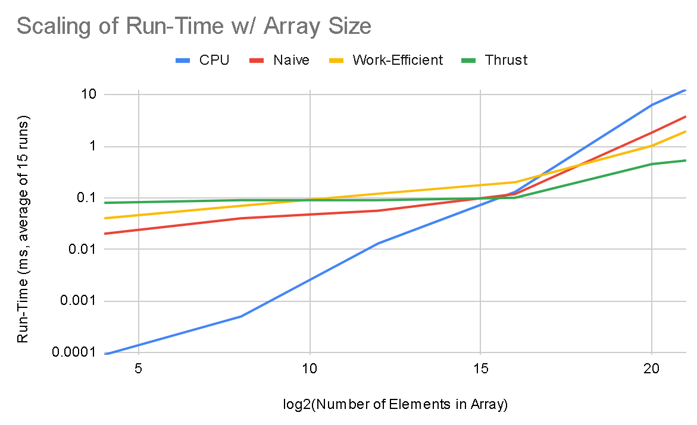

CUDA Stream Compaction
======================

**University of Pennsylvania, CIS 565: GPU Programming and Architecture, Project 2**

A project to implement and analyze the performance of Scan (prefix-sum) on the GPU. In this repo, I implement scan on the CPU as well as on the GPU in two ways, a naive approach and a work efficient approach. I also apply the scan algorithm to perform stream compaction using a scan-scatter approach. Then, I compare the performance of my implementations of scan with the reference thrust implementation provided by Nvidia. Lastly, I compare my different approaches for stream compaction: CPU naive approach, CPU using scan-scatter, and GPU using my work-efficient scan-scatter approach. 

NAME: CHETAN PARTIBAN 

GPU: GTX 970m (Compute Capability 5.2) 

Tested on Windows 10, i7-6700HQ @ 2.60 GHz 16Gb, GTX 970m 6Gb (Personal Laptop) 

## Performance Analysis

For all my performance analysis, I took the average of 15 runs to estimate run-time. I also chose to only look at arrays with size of power 2. This is the best-case for our GPU based algorithms and worst-case for our CPU algorithms. I chose to do this because the only result that would be potentially different for non-power of 2 arrays would be our CPU result, as my GPU results were almost identical for the power of 2 sized arrays and any array smaller, until you reach the next smaller power of two. For all GPU run-times, I also excluded memory allocation, copying, and freeing from the total. Instead, I just focused on the amount of time for the algorithm execution. Here I perform two different performance analyses. 

1. Block Size - What is the effect of Block Size on the performance of my GPU implementations
2. Array Size - How does each approach for the Scan algorithm scale with array size 

**Block Size Analysis**

For my Block Size analysis, I tested both the naive and work-efficient implementations with a variety of potential Block Sizes with a fixed array size of 2^11 elements. The values I tested were [32, 64, 128, 256, 512, 768, 1024]. Interestingly, there does not seem to be much effect on the work-efficient implementation from Block Size. Similarly, for the naive implementation, small Block Size limits performance, whilst all other sizes perform almost identically. I chose to work with a Block Size of 256 for both when doing the performance testing across different scan approaches. 


**Array Size Analysis**

For my array size analysis, I compared the performance of all the approaches (CPU, Naive GPU, Efficient GPU, Thrust) across a variety of array sizes varying from 2^4 elements to 2^20 elements. I have plotted the results on a log-log scale so it is easier to visualize the differences. We can see that for very small arrays, the CPU implementation is the fastest. However, the thrust implementation quickly catches up to it and for arrays of size 2^12 or larger it starts to outperform the CPU-only implementation. We can also see that for smaller arrays, our Naive implementation outperforms the work-efficient implementations. This is likely because, we have to do less extra calculation due to the stricter power-of-2 requirements for the work-efficient implementation, and because the work happens in fewer consecutive stages. However, once we get to very large array sizes, this trend also flips and we can see the work-efficient implementation overtake the naive implementation, as we would expect from its superior asymptotic theoretical scaling. 



**Understanding the Thrust Implementation**

We can see that the Thrust Implementation calls two different types of kernels - an "InitAgent" kernel as well as a "ScanAgent" kernel. We can see these calls in the "Cuda Launch Summary" when we generate a report using the performance analysis tool. These are the only kernels that exist other than the kernels I have defined myself, so therefore, these must ge the two kernel that are used for computation in the Thrust implementation of scan. We can see that for both of these kernels, they are allocated 4 Warps (128 threads) per block. For the InitAgent kernel, 10 registers are used per thread and no shared memory is utilized. The ScanAgent does not use as many registers but does use some shared memory in its implementation. We can also see they get called in an alternating fashion, and always with the same launch parameters and get a total of 60 kernel launcesh (30 of each type) for an array of size 2^8 elements. Because we see this sort of alternative behavior, it is likely that the Thrust impelementation kernel calls each look at only a subset of the array and perform some sort of two-step downsweep/upsweep process on thsi subset. Once the process is performed on all the subsets, the the calculation is complete. It is likely that this functions in some sort of heirarchical way, where the early kernel calls function on small subsets of the array and the later calls merge the results across the array. 

**Result Discussion**

For the CPU implementation, it seems like computation is the main bottleneck. We can see this for the CPU because the CPU implementation has a clear linear scaling, and should not have any memory bottlenecks. We can see that, for most sizes of array, I/O is the biggest bottleneck for our Thrust implementation. This can be seen because the thrust implementation run-time barely changes from array sizes 2^4 to 2^16, however, beyond that point, computation again becomes the bottleneck. We can see similar (albeit, slightly less clean) patterns arrise in our own Naive/Work-Efficient GPU implementations as around 2^16 array elements, the slope of our curve increases substantially. This seems to indicate that, for all the GPU implementations, 2^16 elements seems to be the critical value at which we are most fully utilizing the GTX 970m GPU. 

**[Extra Credit] Lack of Performance for Personal GPU Implementations**

For my implementations, I did not utilize shared memory or one-to-one bank access to speed up I/O operation, and it is likely that this is an optimization that would greatly speed up my algorithm. Especially in my work-efficient algorithm, we are making many random reads to global GPU memory, which is likely causing large performance loss. This particularly effects our work-efficient algorithm because it has 2 * log(N) + 1 kernel calls, whilst our naive implementation only has log(N) kernel calls. This reduces the potential for us to be able to "hide" I/O latency through computation, unless we have very large arrays to process. However, once the number of elements becomes very large, the improved parallelism and efficiency of our work-efficient implementation cover this up, giving it the most speed of all the implementations (except Thrust).

**Example Program Output:**

```
****************** SCAN TESTS ******************                                                                                                            
[  20  28  13  32  32   2   1  19  40  25  34  49  23 ...  43   0 ]                                                 
==== cpu scan, power-of-two ====                           elapsed time: 6.03387ms    (std::chrono Measured)                                                                    
==== cpu scan, non-power-of-two ====                       elapsed time: 6.10951ms    (std::chrono Measured)              passed                                                                                                             
==== naive scan, power-of-two ====                         elapsed time: 2.40527ms    (CUDA Measured)                     passed                                                                                                              
==== naive scan, non-power-of-two ====                     elapsed time: 2.39343ms    (CUDA Measured)                     passed                                                                                                              
==== work-efficient scan, power-of-two ====                elapsed time: 0.971063ms    (CUDA Measured)                    passed                                                                                                             
==== work-efficient scan, non-power-of-two ====            elapsed time: 0.971972ms    (CUDA Measured)                    passed                                                                                                              
==== thrust scan, power-of-two ====                        elapsed time: 0.523031ms    (CUDA Measured)                    passed                                                                                                              
==== thrust scan, non-power-of-two ====                    elapsed time: 0.434082ms    (CUDA Measured)                    passed                                                                                                                                                                                                                                      
******************************* STREAM COMPACTION TESTS *******************************                                                                                             
[   1   2   3   1   2   3   0   2   3   1   2   3   0 ...   1   0 ]                                                 
==== cpu compact without scan, power-of-two ====           elapsed time: 3.71089ms    (std::chrono Measured)              passed                                                                                                              
==== cpu compact without scan, non-power-of-two ====       elapsed time: 3.71827ms    (std::chrono Measured)              passed                                                                                                              
==== cpu compact with scan ====                            elapsed time: 16.5354ms    (std::chrono Measured)              passed                                                                                                              
==== work-efficient compact, power-of-two ====             elapsed time: 1.25834ms    (CUDA Measured)                     passed                                                                                                              
==== work-efficient compact, non-power-of-two ====         elapsed time: 1.24629ms    (CUDA Measured)                     passed      
```
